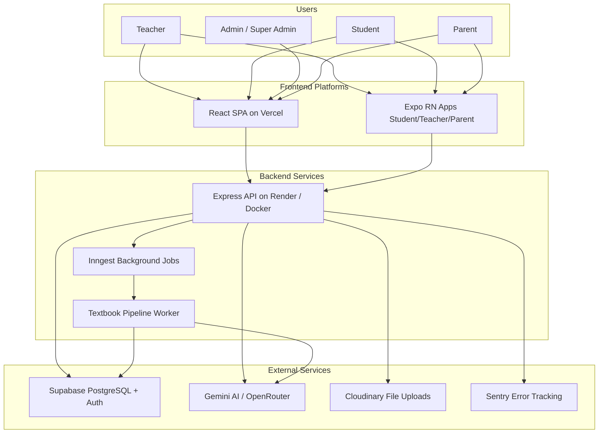
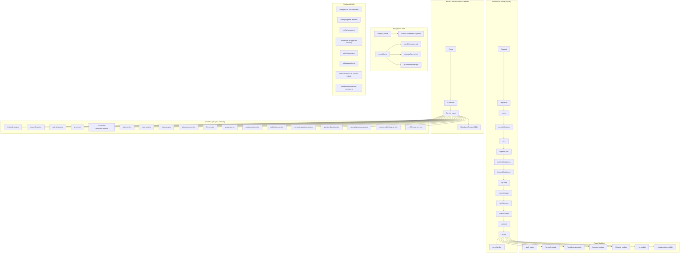
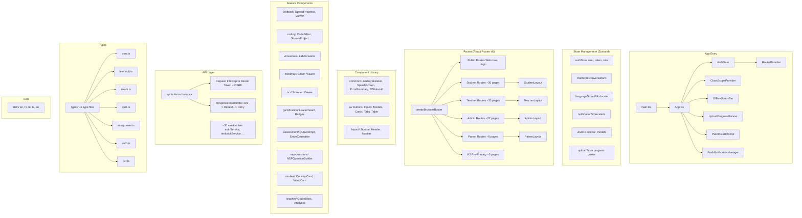
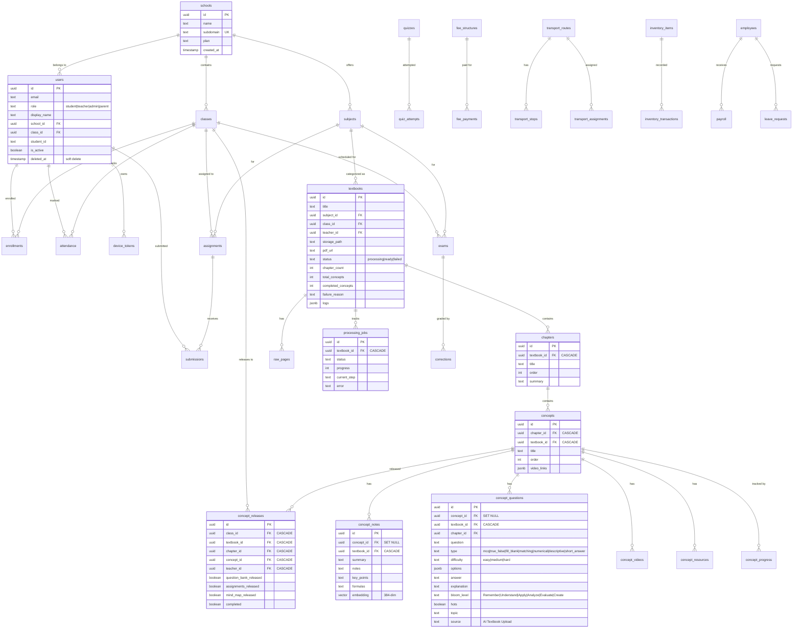
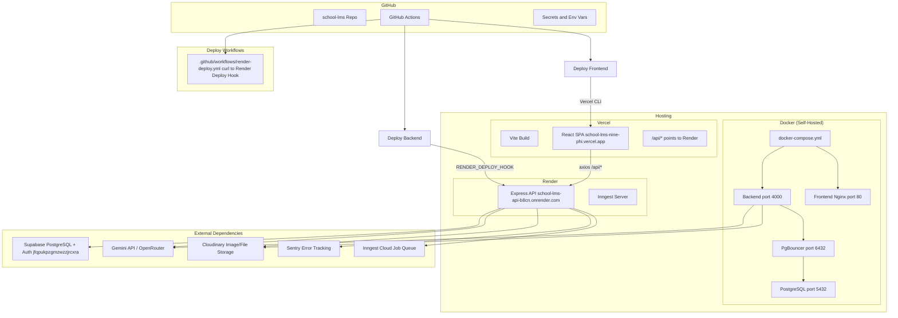
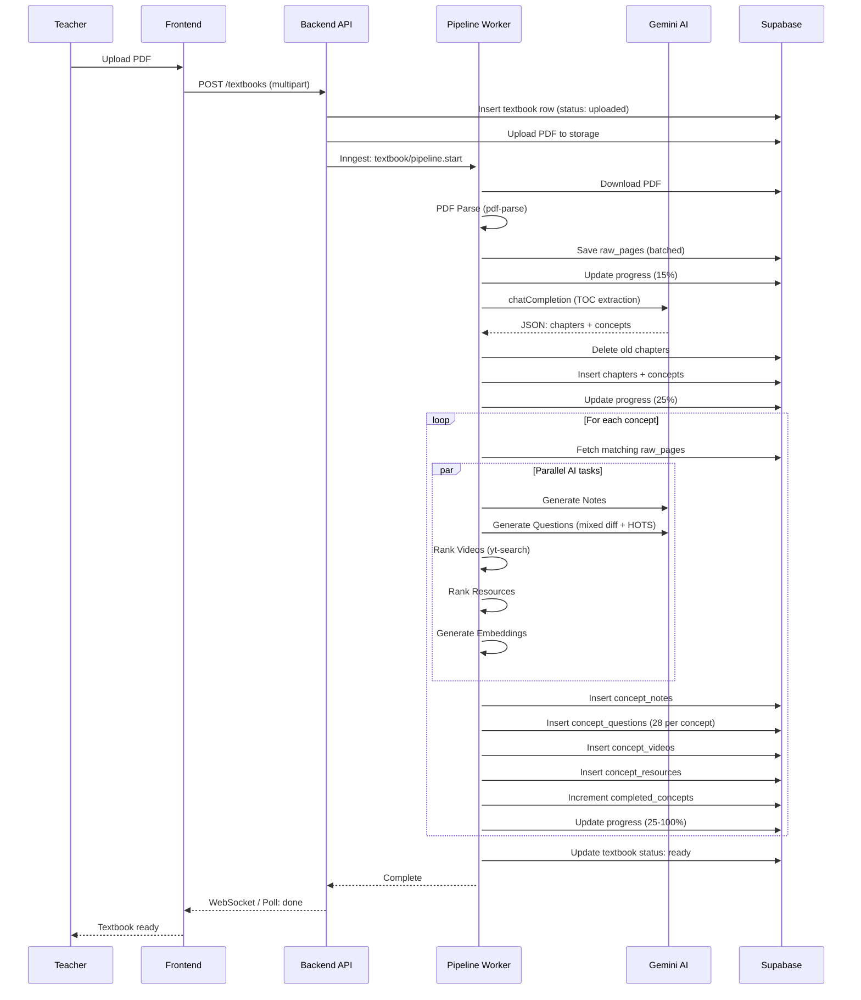
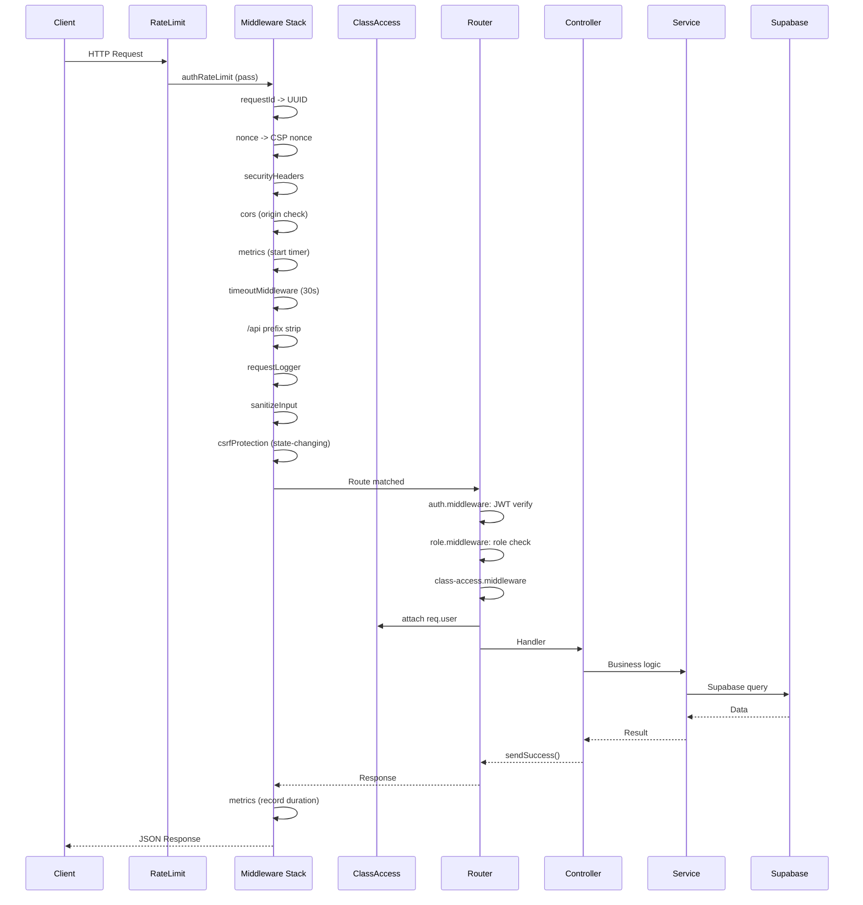
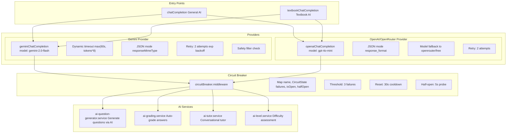

# School LMS — Architecture Diagrams

## 1. System Context (C4 Level 1)

## 2. Backend Architecture (Express.js)

## 3. Frontend Architecture (React)

## 4. Database Entity Relationships

## 5. Infrastructure and Deployment

## 6. Textbook Processing Pipeline

## 7. Request Lifecycle (API)

## 8. AI Service Architecture

