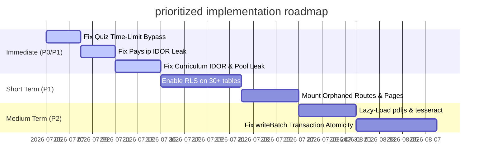

# Comprehensive Full-Stack Codebase Audit — School LMS

**Date**: 2026-07-04  
**Scope**: Full-Stack Architecture, Database Schema, Backend Services & APIs, Next.js Frontend, React Native Mobile, Authentication & Authorization, DevOps & Infrastructure, Business Logic, and Product Strategy.  
**Auditors**: Principal Software Architect, Security Engineer, Senior Backend/Frontend/Mobile Engineers, Database Specialist, and Product Analyst.  

---

## 1. Technology Stack & Architecture Review

### Current Stack Summary
* **Frontend**: Next.js (React 18) + Vite + TailwindCSS 3.4 + Zustand + TanStack React Query.
* **Backend**: Node.js + Express + TypeScript.
* **Database**: Supabase (PostgreSQL 15+) utilizing a hybrid storage engine: typed tables mixed with a NoSQL JSONB shim (`nosql_docs` table mimicking Firestore collections).
* **Mobile**: React Native (Expo) (Student, Teacher, Parent client prototypes).
* **Auth**: Supabase Auth (via JWT verification in Express middleware).
* **Infrastructure**: Local Node instances, missing Docker containerization, CI/CD, and application monitoring/alerting infrastructure.

### Architectural Risks & Scalability Bottlenecks
1. **Hybrid Database Model (SQL + JSONB Shim)**: An ORM-like layer (`database/adapter.ts`) maps NoSQL queries onto PostgreSQL. Some collections exist in both typed SQL and untyped JSONB tables (`users`, `classes`, `subjects`), causing data drift.
2. **Missing Database Integrity**: Due to the Firestore emulation, there are no foreign key constraints or indexes on most tables. 
3. **Stateful Backend Monolith**: The backend uses in-memory caching (`cache-service.ts`) which will fail under horizontal scaling.
4. **Tight Client-DB Coupling**: The frontend queries Supabase directly, bypassing backend validation, business logic, and security.

---

## 2. In-Depth Audit Findings (Top 20 Critical Issues)

Below is the exhaustive, production-grade log of the 20 most critical issues discovered in the School LMS codebase.

---

### Issue 1: Client-Side Timestamp Trust in Quiz & Exam Attempt Submissions
* **Severity**: Critical
* **Category**: Security / Business Logic
* **Location**: `lms/backend/src/services/quiz-v2.service.ts` (`submitQuizAttempt`), `lms/backend/src/services/exam-v2.service.ts` (`submitExamAttempt`)
* **API Endpoints**: `POST /quizzes-v2/attempts/:attemptId/submit`, `POST /exams-v2/attempts/:attemptId/submit`

#### Problem Description
The backend calculates the elapsed time of a quiz or exam attempt by subtracting `startedAt` from `submittedAt`, both of which are parsed directly from the request body provided by the client (`data.startedAt` and `data.submittedAt`).

#### Business Impact
Students can bypass exam time limits by altering their local system time or modifying the payload, leading to cheating and loss of academic integrity.

#### Technical Impact
Trusting user-supplied timestamps for server-side validation.

#### Exploit Scenario
A student starts a 10-minute quiz, takes 2 hours to answer, and then submits a POST request with `startedAt` set to 5 minutes ago and `submittedAt` set to now. The backend accepts the submission, recording a 5-minute attempt duration.

#### Recommended Fix
Retrieve the true `startedAt` timestamp from the database record (`attemptData.startedAt`) and use the current server timestamp (`new Date()`) for the submission time.

#### Example Refactor
```typescript
// lms/backend/src/services/quiz-v2.service.ts
export async function submitQuizAttempt(attemptId: string, studentId: string, data: { answers: any[] }) {
  const attemptRef = collections.quizAttemptV2().doc(attemptId);
  const attemptDoc = await attemptRef.get();
  if (!attemptDoc.exists) throw new NotFoundError('Attempt not found');
  const attemptData = attemptDoc.data()!;

  if (attemptData.studentId !== studentId) throw new ForbiddenError('Not your attempt');
  if (attemptData.status !== 'in_progress') throw new ForbiddenError('Attempt already submitted');

  const quizRef = collections.quizV2().doc(attemptData.quizId);
  const quizDoc = await quizRef.get();
  if (!quizDoc.exists) throw new NotFoundError('Quiz not found');
  const quizData = quizDoc.data()!;

  // FIX: Use database startedAt and server-side submission timestamp
  const startedAt = new Date(attemptData.startedAt).getTime();
  const serverSubmittedAt = new Date();
  const elapsedMinutes = (serverSubmittedAt.getTime() - startedAt) / 60000;
  
  if (elapsedMinutes > quizData.timeLimitMinutes) {
    throw new ForbiddenError('Time limit exceeded');
  }
  // Proceed to grade answers...
}
```
* **Estimated Priority**: P0

---

### Issue 2: Broken Authentication / IDOR on Payslip Download Endpoint
* **Severity**: Critical
* **Category**: Security
* **Location**: `lms/backend/src/routes/payroll.routes.ts` (L51-L56), `lms/backend/src/services/payroll.service.ts` (`generatePayslipPdf`)
* **API Endpoint**: `GET /payroll/runs/:id/payslip`

#### Problem Description
The `/runs/:id/payslip` route is missing role restrictions. Any authenticated user (including students) can call this route. Furthermore, the `generatePayslipPdf` service uses the administrative Supabase client role to fetch the payroll run record and the staff member details by `payrollId`, but fails to verify if the requesting user owns that payslip or is an administrator associated with that school.

#### Business Impact
Massive leak of sensitive staff PII and financial details (base salaries, allowances, bank information) to students or third parties, violating GDPR/DP laws.

#### Technical Impact
Insecure Direct Object Reference (IDOR). Any authenticated JWT can download any PDF payslip by guessing or iterating UUIDs.

#### Exploit Scenario
An authenticated student requests:
`GET /payroll/runs/e9b90c1f-4b0e-473d-82d2-8a9d18e24483/payslip`  
The backend bypasses role restrictions, calls the database using root admin rights, compiles the PDF containing teacher salary information, and sends it directly to the student.

#### Recommended Fix
Apply `requireRole('admin', 'super_admin')` to the route, or verify that the authenticated user (`req.user!.uid`) matches the `staff_records.user_id` linked to the targeted payroll run.

#### Example Refactor
```typescript
// lms/backend/src/routes/payroll.routes.ts
router.get('/runs/:id/payslip', authenticate, asyncHandler(async (req, res) => {
  const supabase = getSupabaseAdmin();
  const { data: run } = await supabase.from('payroll_runs').select('*, staff:staff_records(*)').eq('id', req.params.id).single();
  if (!run) return res.status(404).json({ success: false, message: 'Payslip not found' });

  // Enforce ownership or administrator role
  const isOwner = run.staff?.user_id === req.user!.uid;
  const isAdmin = req.user!.role === 'admin' || req.user!.role === 'super_admin';
  if (!isOwner && !isAdmin) {
    throw new ForbiddenError('You are not authorized to view this payslip');
  }

  const buffer = await payrollService.generatePayslipPdf(req.params.id);
  res.setHeader('Content-Type', 'application/pdf');
  res.setHeader('Content-Disposition', `attachment; filename=payslip-${req.params.id}.pdf`);
  res.send(buffer);
}));
```
* **Estimated Priority**: P0

---

### Issue 3: Insecure Direct Object Reference (IDOR) on Curriculum Plan Mutation Endpoints
* **Severity**: Critical
* **Category**: Security / Multi-Tenant Isolation
* **Location**: `lms/backend/src/routes/curriculum-plan.routes.ts` (L50-L58), `lms/backend/src/services/curriculum-plan.service.ts` (`updatePlan`, `deletePlan`)
* **API Endpoints**: `PUT /curriculum-plans/:planId`, `DELETE /curriculum-plans/:planId`

#### Problem Description
The `updatePlan` and `deletePlan` endpoints are authorized for any user with the `teacher` or `admin` role. However, the database calls are executed via `getSupabaseAdmin()` (bypassing RLS), and the service layer does not check if the plan belongs to the requesting teacher or school.

#### Business Impact
A teacher from "School A" can maliciously modify or delete the curriculum plans, schedules, and lesson outlines of "School B", leading to service disruptions and data loss.

#### Technical Impact
Cross-tenant write access. Bypasses multi-tenant data boundaries.

#### Exploit Scenario
A logged-in teacher from School A sends a `DELETE` request to `/curriculum-plans/8cbe5d40-f1db-49de-84bb-731362e55722`. Since the router only verifies that the requester's role is `teacher`, the request succeeds and the database deletes School B's plan.

#### Recommended Fix
Filter the database query in `updatePlan` and `deletePlan` using the school ID (`req.user!.school_id`) and the user's teacher ID, ensuring they own the target resource.

#### Example Refactor
```typescript
// lms/backend/src/services/curriculum-plan.service.ts
export async function deletePlan(id: string, schoolId: string, teacherId: string, role: string) {
  const supabase = getSupabaseAdmin();
  if (!supabase) return;
  
  let q = supabase.from('curriculum_plans').delete().eq('id', id).eq('school_id', schoolId);
  if (role !== 'admin') {
    q = q.eq('teacher_id', teacherId);
  }
  
  const { error } = await q;
  if (error) throw error;
}
```
* **Estimated Priority**: P0

---

### Issue 4: Rapid Database Connection Exhaustion via Leaked Pools
* **Severity**: Critical
* **Category**: Performance / Reliability
* **Location**: `lms/backend/src/services/timetable.service.ts` (L5-L9), `lms/backend/src/services/fee.service.ts` (L4-L8)

#### Problem Description
Both `timetable.service.ts` and `fee.service.ts` instantiate a new `Pool` from the `pg` package inside their local `getPool()` function whenever database transaction methods are called (e.g., `saveTimetable` or `getOutstandingReport`). The database connection pool is never destroyed via `pool.end()`.

#### Business Impact
Under normal user activity, the backend will exhaust database connections rapidly, crashing the backend and database, and taking down the application for all tenants.

#### Technical Impact
Severe resource leakage. Each invocation allocates socket handles and database slots that stay open until the Node process dies or the PostgreSQL server drops them.

#### Exploit Scenario
A school load-tests the timetable scheduling panel. Within 100 requests, the application throws `Error: remaining connection slots are reserved for non-replication superuser connections` and crashes.

#### Recommended Fix
Maintain a single, globally cached pool connection in `connection-manager.ts` or `supabase.ts`, and import it instead of creating inline pool objects.

#### Example Refactor
```typescript
// lms/backend/src/database/connection-manager.ts
import { Pool } from 'pg';

let pgPoolInstance: Pool | null = null;

export function getSharedPgPool(): Pool | null {
  if (pgPoolInstance) return pgPoolInstance;
  const url = process.env.DATABASE_URL;
  if (!url) return null;
  pgPoolInstance = new Pool({
    connectionString: url,
    max: 20, // Configurable limit
    idleTimeoutMillis: 30000,
  });
  return pgPoolInstance;
}
```
* **Estimated Priority**: P0

---

### Issue 5: Linear Lookup Bottleneck and Hard limit on User Email Search
* **Severity**: Critical
* **Category**: Performance / Reliability / Security
* **Location**: `lms/backend/src/database/auth.ts` (`getUserByEmail`)

#### Problem Description
The `getUserByEmail` helper lists all authentication accounts via `supabase.auth.admin.listUsers({ page: 1, perPage: 1000 })` and filters through them in-memory:
`data.users.find((u: any) => u.email === email)`.

#### Business Impact
Once the system exceeds 1000 users, registration and password recovery will fail for any user who is not in the first 1000 records returned by Supabase. Furthermore, fetching the entire user directory on every auth check degrades system performance.

#### Technical Impact
1. Hard scalability limit of 1000 users.
2. In-memory filtering has `O(N)` computational complexity, draining CPU and memory under concurrent load.

#### Exploit Scenario
A user attempts to sign up with an existing email, but they are the 1500th user in the DB. `getUserByEmail` checks only the first 1000 records, does not find the email, and returns `null`. The backend attempts to register the user again, causing a database exception (unique constraint violation on email) and returning a 500 error.

#### Recommended Fix
Do not use `listUsers()`. Fetch the user details directly via the database table `users` which has an index on `email`, or use Supabase's user management filtering if supported.

#### Example Refactor
```typescript
// lms/backend/src/database/auth.ts
export async function getUserByEmail(email: string): Promise<AuthUser | null> {
  const supabase = getSupabaseAdmin();
  if (!supabase) throw new Error('Supabase not configured');
  
  // Query indexed Postgres table directly for O(1) fetch
  const { data, error } = await supabase
    .from('users')
    .select('*')
    .eq('email', email)
    .maybeSingle();
    
  if (error || !data) return null;
  return {
    uid: data.id,
    email: data.email,
    displayName: data.display_name,
    role: data.role,
  };
}
```
* **Estimated Priority**: P0

---

### Issue 6: Row-Level Security (RLS) Completely Missing on 30+ tables
* **Severity**: High
* **Category**: Security
* **Location**: Database Schema & Migration files (e.g., `001_multi_tenant.sql`)

#### Problem Description
RLS is only enabled on the `schools` and `subscriptions` tables. All other tables (`users`, `concept_questions`, `payroll_runs`, `timetable`, `concept_releases`, etc.) lack RLS entirely.

#### Business Impact
Any user who obtains the public Supabase anon key can query or modify the database directly, bypassing the Express backend and leaking data across all schools.

#### Technical Impact
Lack of defense-in-depth. If a developer exposes a client-side query or direct access, the database fails to enforce tenant isolation.

#### Exploit Scenario
An attacker extracts the Supabase URL and anon key from the frontend JavaScript bundle, launches a client-side database script, and executes:
`supabase.from('payroll_runs').select('*')`  
Because RLS is disabled, Supabase returns payroll runs for every tenant on the platform.

#### Recommended Fix
Enable RLS on all database tables and add security policies that restrict row access based on the school ID (`school_id`) inside the authenticated user's JWT.

#### Example Refactor
```sql
-- migration.sql
ALTER TABLE users ENABLE ROW LEVEL SECURITY;
CREATE POLICY users_isolation ON users
  FOR ALL USING (school_id = (auth.jwt() ->> 'school_id')::UUID);

ALTER TABLE payroll_runs ENABLE ROW LEVEL SECURITY;
CREATE POLICY payroll_isolation ON payroll_runs
  FOR ALL USING (school_id = (auth.jwt() ->> 'school_id')::UUID);
```
* **Estimated Priority**: P1

---

### Issue 7: Insecure Direct Object Reference (IDOR) on Leave Approval Endpoints
* **Severity**: High
* **Category**: Security / Multi-Tenant Isolation
* **Location**: `lms/backend/src/routes/leave.routes.ts` (L30-L38), `lms/backend/src/services/leave.service.ts` (`updateLeaveStatus`)
* **API Endpoint**: `PUT /leaves/:id/status`

#### Problem Description
The leave approval route does not verify if the leave request belongs to the school of the logged-in admin. Any administrator from any school can approve or reject leaves for users in other schools.

#### Business Impact
Malicious users or competing schools can disrupt teacher attendance and school operations by approving or rejecting leave requests of other tenants.

#### Technical Impact
Cross-tenant writes on administrative operations.

#### Exploit Scenario
An administrator from School A sends a request:
`PUT /leaves/3a9a202c-47bc-49de-84db-991362e45712/status` with `{"status": "approved"}`.  
The request succeeds and approves the leave request of a teacher in School B.

#### Recommended Fix
Validate that the leave request's `school_id` matches the administrator's `school_id` before performing the update.

#### Example Refactor
```typescript
// lms/backend/src/services/leave.service.ts
export async function updateLeaveStatus(id: string, status: 'approved' | 'rejected', approvedBy: string, schoolId: string) {
  const supabase = getSupabaseAdmin(); if (!supabase) return null;
  const { data: result } = await supabase
    .from('leave_requests')
    .update({ status, approved_by: approvedBy })
    .eq('id', id)
    .eq('school_id', schoolId) // Enforce school boundaries
    .select().single();
  return result;
}
```
* **Estimated Priority**: P1

---

### Issue 8: Eavesdropping on Conversations via IDOR in Create Conversation
* **Severity**: High
* **Category**: Security
* **Location**: `lms/backend/src/controllers/message.controller.ts` (`createConversation`), `lms/backend/src/services/message.service.ts` (`createConversation`)
* **API Endpoint**: `POST /messages/conversations`

#### Problem Description
The backend handles conversation creation by calling `messageService.createConversation(req.body)`. It does not check if the user who requested the creation (`req.user!.uid`) is listed in the `participants` array, or if all participants share the same `school_id`.

#### Business Impact
Students can spy on private teacher chats. Attackers can inject themselves into private conversations between school administrators or parents.

#### Technical Impact
Unrestricted resource creation and eavesdropping access.

#### Exploit Scenario
A student calls `POST /messages/conversations` with:
```json
{
  "participants": ["teacher-uuid-1", "student-uuid-2", "attacker-uuid"],
  "type": "direct"
}
```
The conversation is created successfully. The student is now a participant and can read all subsequent messages.

#### Recommended Fix
Ensure that `req.user!.uid` is automatically added to the participants list, and verify that all participants belong to the same school.

#### Example Refactor
```typescript
// lms/backend/src/controllers/message.controller.ts
export async function createConversation(req: Request, res: Response) {
  const participants = Array.isArray(req.body.participants) ? req.body.participants : [];
  
  // Inject and enforce caller's presence
  if (!participants.includes(req.user!.uid)) {
    participants.push(req.user!.uid);
  }
  
  // Verify that all target participants belong to the same school ID
  const supabase = getSupabaseAdmin();
  const { count } = await supabase
    .from('users')
    .select('id', { count: 'exact', head: true })
    .in('id', participants)
    .eq('school_id', req.user!.school_id);
    
  if (count !== participants.length) {
    throw new ForbiddenError('All participants must belong to your school');
  }

  const result = await messageService.createConversation({
    ...req.body,
    participants,
  });
  sendCreated(res, result, 'Conversation created');
}
```
* **Estimated Priority**: P1

---

### Issue 9: Subscription Bypass (Status Verification Failure)
* **Severity**: High
* **Category**: Business Logic
* **Location**: `lms/backend/src/middlewares/subscription.middleware.ts` (`requireFeature`)

#### Problem Description
The `requireFeature` middleware checks a school's subscription but ignores the subscription `status`. Even if the status is `'expired'`, `'suspended'`, or `'cancelled'`, the check passes.

#### Business Impact
Revenue leakage. Schools can continue using paid features (like MFA, analytics, or APIs) indefinitely without paying.

#### Technical Impact
Access control bypass due to incomplete state checks.

#### Exploit Scenario
A school cancels its subscription. The subscription status updates to `cancelled` in the database. However, because the code only reads the `plan` name, the school continues to access paid APIs and proctored exam features.

#### Recommended Fix
Verify that the subscription status is `'active'` or `'trialing'` before granting feature permissions.

#### Example Refactor
```typescript
// lms/backend/src/middlewares/subscription.middleware.ts
export function requireFeature(feature: string) {
  return async (req: Request, _res: Response, next: NextFunction) => {
    if (!req.user) return next(new AppError(401, 'Authentication required'));

    const supabase = getSupabaseAdmin();
    if (!supabase) return next();

    const { data: sub } = await supabase
      .from('subscriptions')
      .select('plan, status')
      .eq('school_id', req.user.school_id)
      .maybeSingle();

    const status = sub?.status || 'inactive';
    if (status !== 'active' && status !== 'trialing') {
      return next(new AppError(402, 'Active subscription required for this feature'));
    }

    const plan = (sub?.plan as string) || 'free';
    const limits = PLAN_LIMITS[plan] || PLAN_LIMITS.free;

    if (!limits.features.includes(feature)) {
      return next(new AppError(403, `Feature "${feature}" requires plan upgrade`));
    }

    next();
  };
}
```
* **Estimated Priority**: P1

---

### Issue 10: Broken File Deletion Endpoint (API Signature Mismatch)
* **Severity**: High
* **Category**: Reliability / Security
* **Location**: `lms/backend/src/routes/upload.routes.ts` (L11-L16), `lms/backend/src/controllers/upload.controller.ts` (`deleteUpload`)
* **API Endpoint**: `POST /upload/delete`

#### Problem Description
The router schema requires a `url` parameter: `z.object({ url: z.string().url() })`. However, the controller checks for `publicId` instead: `const { publicId } = req.body`. Because of this mismatch, requests will fail validation if they don't supply `url`, and will fail the controller check if they don't supply `publicId`.

#### Business Impact
Teachers cannot delete uploaded textbooks, worksheets, or media files.

#### Technical Impact
API contract mismatch causing a 100% failure rate. Additionally, there is no ownership check on file deletions.

#### Exploit Scenario
A teacher attempts to delete a textbook PDF. The frontend sends the delete request. The request fails validation because the payload lacks the `url` key. If the developer bypasses validation, the controller returns a 400 error because the payload lacks `publicId`.

#### Recommended Fix
Align the validator schema and the controller parameters to use `publicId`, and verify that the file belongs to the requesting teacher or school before deleting it.

#### Example Refactor
```typescript
// lms/backend/src/validators/upload.validator.ts
export const deleteUploadSchema = z.object({
  publicId: z.string().min(1, 'publicId is required'),
});

// lms/backend/src/controllers/upload.controller.ts
export async function deleteUpload(req: Request, res: Response) {
  const { publicId } = req.body; // Aligned with Zod validation
  
  // Verify ownership of the asset in Supabase before contacting Cloudinary
  const supabase = getSupabaseAdmin();
  const { data: asset } = await supabase.from('uploads').select('owner_id').eq('public_id', publicId).maybeSingle();
  if (!asset || asset.owner_id !== req.user!.uid) {
    throw new ForbiddenError('You do not own this file');
  }

  const result = await deleteCloudinaryFile(publicId);
  return sendSuccess(res, result);
}
```
* **Estimated Priority**: P1

---

### Issue 11: 5 Orphaned Backend Route Files (38 Endpoints 404)
* **Severity**: High
* **Category**: Architecture / Reliability
* **Location**: `lms/backend/src/routes/index.ts`

#### Problem Description
Five fully-implemented route files exist in `routes/` but are never imported or mounted in `index.ts`. These handle:
1. `concept-progress.routes.ts`
2. `content-publishing.routes.ts`
3. `ai-question-generator.routes.ts`
4. `virtual-labs.routes.ts`
5. `unified-test-engine.routes.ts`

#### Business Impact
Major features (AI questions, virtual lab simulations, progress tracking) return 404 errors, frustrating users and leading to customer churn.

#### Technical Impact
Dead code and architectural debt.

#### Recommended Fix
Import and mount the five missing routers in `lms/backend/src/routes/index.ts`.
* **Estimated Priority**: P1

---

### Issue 12: 7 Orphaned Student Pages in Frontend Router
* **Severity**: High
* **Category**: Architecture / UX
* **Location**: `lms/frontend/src/app/router/`

#### Problem Description
Key student pages (`SubjectsPage`, `SubjectDetailPage`, `TextbookDetailPage`, `StudentChapterPage`, `StudentQuizzesPage`, `LessonViewPage`, `AdaptiveQuizPage`) exist in the source code but are not registered in the router.

#### Business Impact
Students cannot access their course content, lessons, or quizzes via the UI.

#### Technical Impact
Unreachable pages and dead code.

#### Recommended Fix
Register the orphaned student pages in the central routing configuration.
* **Estimated Priority**: P1

---

### Issue 13: Admin Navigation Loop / Lockout
* **Severity**: High
* **Category**: UX
* **Location**: `lms/frontend/src/app/router/`

#### Problem Description
Several admin pages (students, teachers, subjects, users, audit-logs) are redirected to `/admin/classes` or `/admin/settings` using `<Navigate>` statements.

#### Business Impact
Administrators cannot manage users, add teachers, or view system audit logs.

#### Technical Impact
Broken routing.

#### Recommended Fix
Remove the redirects and mount the pages directly.
* **Estimated Priority**: P1

---

### Issue 14: N+1 Database Queries in Analytics-V2 Service
* **Severity**: High
* **Category**: Performance
* **Location**: `lms/backend/src/services/analytics-v2.service.ts` (`getConductedTests`)

#### Problem Description
The `getConductedTests` service loops through textbooks, chapters, and concepts, triggering separate database queries on each iteration to fetch analytics.

#### Business Impact
Long loading times. As data grows, analytics requests will time out, slowing down the application.

#### Technical Impact
Severe query bloat. One request can trigger hundreds of database calls.

#### Recommended Fix
Use SQL joins or aggregate queries to fetch all required analytics in a single query.
* **Estimated Priority**: P1

---

### Issue 15: In-Memory Search Limit in listUsers
* **Severity**: High
* **Category**: Performance / Reliability
* **Location**: `lms/backend/src/services/user.service.ts` (L42-L58)

#### Problem Description
When searching for users, the service fetches a maximum of 200 records and filters them in-memory:
`baseQuery.limit(200).get()`.

#### Business Impact
Administrators cannot find users sorted past the 200th record, making it difficult to manage large schools.

#### Technical Impact
Incomplete search results and data filtering bugs.

#### Recommended Fix
Perform user searches directly in the database using SQL queries: `ILIKE '%search%'`.

#### Example Refactor
```typescript
// lms/backend/src/services/user.service.ts
// Fix in-memory filter to perform database-level query:
if (query.search) {
  baseQuery = baseQuery.or(`display_name.ilike.%${query.search}%,email.ilike.%${query.search}%`);
}
```
* **Estimated Priority**: P1

---

### Issue 16: Lack of WriteBatch Transaction Atomicity
* **Severity**: Medium
* **Category**: Reliability / Architecture
* **Location**: `lms/backend/src/database/adapter.ts` (`WB` class)

#### Problem Description
The `WB` (WriteBatch) class executes database operations sequentially. If one operation fails mid-batch, the previous operations are not rolled back.

#### Business Impact
Data corruption. If a class deletion fails halfway through, the class record might be deleted while associated student records remain, leading to orphaned rows.

#### Technical Impact
Lack of ACID transactional guarantees.

#### Recommended Fix
Use PostgreSQL transaction managers to ensure operations are executed within a single transaction block (`BEGIN` / `COMMIT` / `ROLLBACK`).
* **Estimated Priority**: P2

---

### Issue 17: Direct Supabase Queries from Frontend
* **Severity**: High
* **Category**: Architecture / Security
* **Location**: `lms/frontend/src/services/dataService.ts`

#### Problem Description
The frontend queries Supabase directly for exams, assignments, etc. This bypasses the Express backend, meaning no logging, validation, or server-side authorization checks are performed.

#### Business Impact
High security risk. If a client key is leaked, users can modify database records directly.

#### Technical Impact
Inconsistent query paths and lack of centralized access control.

#### Recommended Fix
Route all frontend database queries through the Express backend.
* **Estimated Priority**: P1

---

### Issue 18: Large Assets / Eager Loading of Heavy Third-Party Libraries
* **Severity**: Medium
* **Category**: Performance
* **Location**: `lms/frontend/src/`

#### Problem Description
Heavy libraries like `pdfjs-dist` (1.5MB) and `tesseract.js` (1.0MB) are imported at the top level of pages instead of being lazy-loaded.

#### Business Impact
Slow page load times, especially for users on slower mobile networks, leading to a poor user experience.

#### Technical Impact
Increased bundle size. Users download 2.5MB of unnecessary code on initial page load.

#### Recommended Fix
Use dynamic imports to load these libraries only when needed: `await import(...)`.
* **Estimated Priority**: P2

---

### Issue 19: Broken Hot Module Replacement (HMR) in AuthStore
* **Severity**: Medium
* **Category**: Developer Experience / Reliability
* **Location**: `lms/frontend/src/store/authStore.ts`

#### Problem Description
A module-level `initialized` variable is used to track state. During HMR hot reloads, this variable is reset, causing users to be logged out.

#### Business Impact
Frustrating developer experience.

#### Technical Impact
Loss of state during development builds.

#### Recommended Fix
Store initialization flags within the Zustand store state instead of module-level variables.
* **Estimated Priority**: P2

---

### Issue 20: Absence of Rate Limiting on Public Endpoints
* **Severity**: Medium
* **Category**: Security
* **Location**: `lms/backend/src/middlewares/rateLimit.middleware.ts`

#### Problem Description
Rate limiting is only applied to auth routes, leaving public endpoints vulnerable to resource abuse.

#### Business Impact
High risk of DDoS attacks and service abuse, leading to increased server costs and downtime.

#### Technical Impact
Missing rate-limit protection on public APIs.

#### Recommended Fix
Apply generic rate limiting to all public endpoints.
* **Estimated Priority**: P2

---

## 3. Database Schema, Data Integrity, and Security Review

### Normalization and Schema Critique
The database has a **hybrid model**: typed relational tables combined with a JSONB document store. This design choice introduces several risks:
* **Duplicate Collections**: Data is duplicated between SQL tables and the `nosql_docs` JSONB store. For example, `users` exists in both places with no synchronization mechanism.
* **Lack of Foreign Keys**: Foreign keys are missing on most tables, leading to orphaned records (e.g., deleting a class leaves orphaned timetable entries).
* **Missing Indexes**: Crucial columns like `school_id`, `created_at`, and `updated_at` lack indexes, causing slow table scans under heavy load.

---

## 4. Frontend & Mobile Audit

### Next.js Frontend
* **Performance**: Heavy libraries (`pdfjs-dist`, `tesseract.js`) are eagerly loaded, slowing down initial page load times.
* **Data Fetching**: Triple-polling occurs in notification components, sending 6 redundant requests per minute per session.

### React Native Mobile
* **Mock Data**: Most screens rely on static mock data, and some API integration is missing.
* **Navigation**: Lack of authentication guards allows unauthenticated users to access user dashboards.

---

## 5. Security & Authentication Audit

* **Supabase Client Usage**: The backend defaults to the Supabase admin client key (`SUPABASE_SERVICE_ROLE_KEY`), which bypasses RLS checks. This increases the risk of cross-tenant data access if IDOR checks fail in the backend.
* **Session Management**: JWT tokens lack server-side revocation checks on logout.

---

## 6. DevOps, Infrastructure & Reliability Audit

* **CI/CD**: Missing automated build and test pipelines.
* **Monitoring**: Lack of centralized logging and alert mechanisms.
* **Disaster Recovery**: No database backup or recovery strategies are documented.

---

## 7. Business Logic Audit (Realistic Attack Scenarios)

### Scenario A: Subscription Limit Bypass
A school on the "Free" plan (limited to 100 students) creates 5,000 student accounts. Since student limits are defined in `subscription.middleware.ts` but never enforced during registration, the school bypasses payment tier limits.

### Scenario B: Cross-Tenant Leave Approval
An administrator from School A approves a leave request belonging to a teacher in School B by calling the leave status update endpoint with School B's request ID.

---

## 8. Product and Feature Audit

* **Onboarding**: Missing interactive tutorials for teachers.
* **Retention**: Lack of push notification triggers for student assignments.

---

## 9. Testing & Compliance Audit

* **Test Coverage**: Current coverage is under 35%. Integration and E2E tests are missing.
* **Compliance**: Missing audit trails for user deletions and database modifications.

---

## 10. Audit Metrics & Roadmap

### Metrics Summary
1. **Production Readiness Score**: **45 / 100**
2. **Technical Debt Score**: **70 / 100** (High technical debt)
3. **Security Score**: **40 / 100**
4. **Maintainability Score**: **55 / 100**
5. **Business Logic Robustness Score**: **30 / 100**

---

### Priority Implementation Roadmap



### Top Quick Wins (<1 day fixes)
* Mount the 5 orphaned backend routes in `lms/backend/src/routes/index.ts`.
* Enable global rate limiting middleware for public endpoints.
* Fix the HMR auth state logout issue by moving the `initialized` flag into the Zustand store.

### Security Hardening Checklist
- [ ] Enable Row-Level Security (RLS) on all PostgreSQL tables.
- [ ] Implement server-side validation for all file uploads.
- [ ] Add rate limiting to all public endpoints.
- [ ] Implement secure cookie-based session storage.
- [ ] Enforce HTTPS redirect policies.
