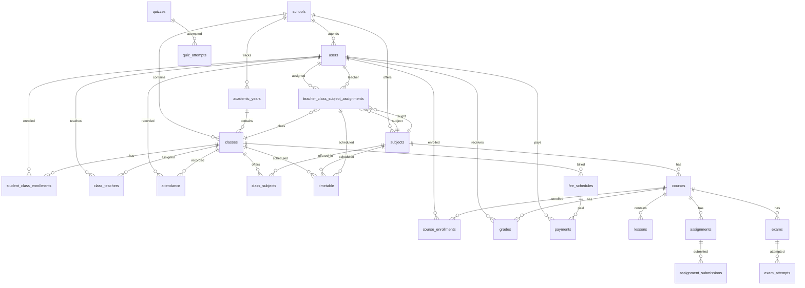

# Refactor LMS Data Architecture — Normalized PostgreSQL Schema, Entity Lifecycles, Migration Strategy

## Problem Frame

The Genesis LMS backend (199 TypeScript files, ~18,550 LOC) runs on Supabase PostgreSQL but uses a **Firestore-compatibility adapter** (`backend/src/database/adapter.ts`, 513 lines) that stores 40+ domain entities in a single `nosql_docs` JSONB table. This creates five systemic problems:

1. **No referential integrity** — FK constraints are absent across 40+ collections. Deleting a class silently orphans timetable entries, TCS assignments, attendance records, fee schedules, and grade references.
2. **Hard-delete cascades** — `backend/src/services/class.service.ts:deleteClass()` hard-deletes full student user records, timetable entries, and TCS assignments with application-level loops instead of DB-level cascade. Teachers are preserved but students are destroyed.
3. **Denormalized arrays** — `users.class_ids TEXT[]`, `classes.teacherIds[]`, `classes.subjectIds[]`, `classes.studentIds[]` are hand-maintained arrays that drift out of sync. No junction tables exist for many-to-many relationships.
4. **Adapter overhead** — 513-line adapter layer adds indirection, prevents native PostgreSQL features (transactions, CHECK constraints, composite FKs), and makes every query go through a JSONB routing layer that cannot use native Postgres query planning.
5. **No soft-delete/archive lifecycle** — Most entities are either present or hard-deleted. No audit trail, no archive state, no retention of historical records when a class is closed or a student graduates.

## Scope Boundaries

### In Scope
- **Phase 1**: Design normalized PostgreSQL schema with typed tables, FK constraints, junction tables, proper indexes. Create migration SQL file.
- **Phase 2**: Add soft-delete columns (`deleted_at`, `archived_at`, `status`) to ALL entities. Define entity lifecycle rules (which entities get soft-delete vs archive vs hard-delete).
- **Phase 3**: Rewrite `backend/src/services/class.service.ts` — replace cascade hard-delete with proper archive flow using `impact.service.ts` checks.
- **Phase 4**: Add junction tables for many-to-many relationships (`class_teachers`, `class_subjects`, `student_class_enrollments`). Migrate denormalized arrays to junction tables.
- **Phase 5**: Add proper DB-level migration system (versioned SQL files, not `CREATE IF NOT EXISTS`).
- **Phase 6**: Migrate core business entities from `nosql_docs` to typed tables (classes, subjects, teacherClassSubject, timetable, attendance, grades, feeSchedules, payments, academicYears, enrollments).
- **Phase 7**: Update adapter.ts to route migrated collections to typed tables; add GIN indexes to remaining nosql_docs.
- **Phase 8**: Update impact.service.ts with all entity dependency chains.

### Deferred for Later
- Migrate gamification, mindmaps, virtual labs, coding projects, pre-primary content — these are loosely coupled to the core academic data model and benefit less from FK constraints.
- Migrate messaging/notifications — these are append-only logs with no FK dependencies on core entities.
- Full removal of the adapter layer — kept as a bridge until all 40+ collections are migrated.
- RLS policy rewrite for new tables — existing backend service-role bypass works for now.

### Outside Scope
- Frontend changes (all changes are backend service + DB; frontend uses API endpoints that stay the same).
- Mobile app changes (same API contract).
- Performance optimization of pgvector queries.
- Data migration of production records (schema migration only — data migration scripts are noted but not built).

## Key Technical Decisions

| Decision | Rationale |
|----------|-----------|
| Soft-delete with `deleted_at` timestamp | Preserves referential integrity for historical records; FK constraints still work on non-deleted rows |
| Archive state via `status = 'archived'` + `archived_at` | Separate from soft-delete — archived entities are visible in reports but blocked from mutations |
| Junction tables for all many-to-many | Eliminates denormalized array drift, enables FK enforcement, supports querying via JOINs |
| Versioned SQL migrations in `backend/supabase/migrations/` | Replaces single `schema.sql` with ordered, repeatable migrations |
| Keep adapter.ts as a routing layer | Avoids rewriting all 40+ services at once; each migration flips a collection from nosql_docs → typed table |
| Backend bypasses RLS with service_role_key | Existing pattern; new typed tables get RLS policies only when direct SDK access is needed |

## Current Architecture Analysis

### The Adapter Problem

`backend/src/database/adapter.ts` implements a Firestore-compatible API over PostgreSQL:

```
┌──────────────────────────────────────────────────────────────┐
│                    Service Layer (49 files)                    │
│  classes() → ColRef → Query → where() → get() → DocSnap[]    │
└──────────────────────────┬───────────────────────────────────┘
                           │ Firestore-like API
┌──────────────────────────▼───────────────────────────────────┐
│                 adapter.ts (513 LOC)                          │
│                                                              │
│  TYPED_TABLES: users, textbooks, chapters, concepts,         │
│                concept_notes, concept_videos,                 │
│                concept_questions, concept_resources,          │
│                processing_jobs, raw_pages,                    │
│                + classes, subjects, grades, assignments,      │
│                  exams, notifications, submissions,           │
│                  corrections, quizzes, quizv2, timetable,     │
│                  lessons, auditlogs, enrollments              │
│                                                              │
│  ↓ typed? → direct SQL on typed table                        │
│  ↓ not typed? → nosql_docs JSONB table                       │
└──────────────────────────┬───────────────────────────────────┘
                           │
┌──────────────────────────▼───────────────────────────────────┐
│              PostgreSQL 15 (Supabase)                         │
│                                                              │
│  Typed tables (11)        nosql_docs (40+ collections)       │
│  - users                  - classes, subjects                │
│  - textbooks              - courses, lessons                 │
│  - chapters               - assignments, exams               │
│  - concepts               - grades, attendance               │
│  - concept_notes          - timetable, feeSchedules          │
│  - concept_videos         - payments, teacherClassSubject    │
│  - concept_questions      - enrollments, academicYears       │
│  - concept_resources      - gamification*, etc.              │
│  - processing_jobs                                           │
│  - raw_pages                                                 │
└──────────────────────────────────────────────────────────────┘
```

**Key issues:**
- `TYPED_TABLES` in adapter.ts lines 10-35 defines column sets for classes, subjects, grades, etc. but these entities are NOT created as actual PostgreSQL typed tables — they are still routed through the typed table path only in adapter logic but exist as `nosql_docs` entries at the DB level (or have incomplete typed table definitions that are neither consistently used nor enforced).
- The `classes` entry in `TYPED_TABLES` defines columns like `teacherIds`, `subjectIds`, `studentIds` as arrays stored in JSONB `data` column — no typed table exists in the schema.
- `collections.teacherClassSubject()` routes to `nosql_docs` with `collection='teacherClassSubject'` — no FK enforcement on teacherId, classId, or subjectId.
- Queries on nested JSONB fields use `data->>field` which cannot use standard B-tree indexes without expression indexes.

### The Hard-Delete Cascade Problem

`backend/src/services/class.service.ts:deleteClass()` (lines 61-108):

```
deleteClass(classId)
  → queries all users with 'classIds' array-contains classId AND role='student'
  → for each student: batch.delete(user record)         ← FULL USER DELETION
  → queries all timetable entries with classId == classId
  → for each entry: batch.delete(timetable entry)
  → queries all teacherClassSubject entries with classId == classId
  → for each entry: batch.delete(TCS entry)
  → deletes the class itself
```

Problems:
1. **Hard-deletes students** — destroys user profiles, grade history, attendance records, submission history, payment records
2. **Application-level cascade** — N+1 queries, no atomicity (partial failure leaves system in inconsistent state)
3. **No warning** — controller calls deleteClass without impact check; impact.service.ts reports `canDelete: true` even when dependents exist

`backend/src/services/impact.service.ts:getClassImpact()` (lines 88-130) contradicts safe deletion:
- Returns `canDelete: true` and `recommendedAction: 'delete'` even when students, teachers, OR timetable entries exist
- Only checks: students count, teachers count, timetable entries — does NOT check attendance, grades, fee payments, assignments linked to this class

### The Denormalized Array Problem

Current storage of relationships uses hand-maintained TEXT[] arrays:

| Entity | Field | Problem |
|--------|-------|---------|
| `users` | `class_ids TEXT[]` | Every add/remove requires reading, modifying, rewriting entire array |
| `users` | `children_ids TEXT[]` | Same — parent-child linking is denormalized |
| `classes` | `teacherIds TEXT[]` | No FK enforcement; teachers can be deleted without cleanup |
| `classes` | `subjectIds TEXT[]` | No FK enforcement; subjects can be removed from class without updating |
| `classes` | `studentIds TEXT[]` | Duplicate of user.class_ids — dual-write drift |

The `addStudents()` / `removeStudents()` methods in `class.service.ts` must update BOTH `user.class_ids` AND `class.studentIds` in a batch, but the write is not atomic — if one write fails, arrays drift.

### The Missing FK Problem

Current FK references that should exist but don't:

| Relationship | Referencing | Referenced | Current Storage |
|-------------|-------------|------------|-----------------|
| student → class | student_class_enrollments | users, classes | `user.class_ids[]` array |
| teacher → class | class_teachers | users, classes | `class.teacherIds[]` array |
| subject → class | class_subjects | subjects, classes | `class.subjectIds[]` array |
| teacher-class-subject | teacherClassSubject | users, classes, subjects | nosql_docs |
| attendance | attendance | users (student), classes | nosql_docs |
| grade | grades | users (student), classes | nosql_docs |
| fee schedule | feeSchedules | classes | nosql_docs |
| payment | payments | users (student), feeSchedules | nosql_docs |
| timetable | timetable | classes, subjects, users | nosql_docs |
| course enrollment | enrollment | users (student), courses | nosql_docs |
| academic year | academicYears | — (standalone) | nosql_docs |

## Entity Lifecycle Definitions

Every core entity follows one of three lifecycle patterns:

### Pattern A: Soft-Delete (`deleted_at`)
Entity is "deleted" by setting `deleted_at = now()`. FK constraints remain active (cascading or restricting). Queries filter `WHERE deleted_at IS NULL` by default. Used for entities that must be recoverable.

### Pattern B: Archive (`status = 'archived'` + `archived_at`)
Entity is moved to read-only archive state. All FK references remain valid. Used for entities at end of academic lifecycle.

### Pattern C: Hard-Delete (actual row removal)
Used only for transient, non-referential data (processing jobs, raw pages, expired tokens, notifications after TTL).

### Entity Lifecycle Matrix

| Entity | Pattern | Deleted State | Cascade on Parent Delete | Notes |
|--------|---------|---------------|--------------------------|-------|
| `schools` | B | `status='archived'` | — | Root entity; never hard-deleted |
| `users` (all roles) | A | `deleted_at` set | RESTRICT (must unlink from classes first) | Student deletion orphans grades/attendance; always soft-delete |
| `classes` | B | `status='archived'`, `archived_at` | — | End-of-year archive; FK children cascade |
| `subjects` | B | `status='archived'` | — | Cross-class subjects archived, not deleted |
| `class_teachers` | A | `deleted_at` set | CASCADE on class delete, RESTRICT on teacher delete | Junction row; auto-cleaned when class is archived |
| `class_subjects` | A | `deleted_at` set | CASCADE on class delete, RESTRICT on subject delete | Junction row; auto-cleaned when class is archived |
| `student_class_enrollments` | A | `deleted_at` set | CASCADE on class delete, RESTRICT on student delete | Graduation = soft-delete enrollment |
| `teacher_class_subject_assignments` | A | `deleted_at` set | CASCADE on class/subject delete, RESTRICT on teacher delete | Replaced by reassignment |
| `timetable` | A | `deleted_at` set | CASCADE on class/subject/teacher delete | Historical timetable preserved |
| `courses` | B | `status='archived'` | RESTRICT (must unenroll all students first) | Course archive preserves enrollment history |
| `course_enrollments` | A | `deleted_at` set | CASCADE on course/student delete | Grade records FK to enrollment |
| `lessons` | A | `deleted_at` set | CASCADE on course delete | — |
| `assignments` | B | `status='archived'` | — | Archived assignments preserve submissions |
| `assignment_submissions` | A | `deleted_at` set | CASCADE on assignment/student delete | Never hard-deleted |
| `exams` | B | `status='archived'` | — | Archived exams preserve attempts |
| `exam_attempts` | A | `deleted_at` set | CASCADE on exam/student delete | — |
| `quizzes` | B | `status='archived'` | — | — |
| `quiz_attempts` | A | `deleted_at` set | CASCADE on quiz/student delete | — |
| `grades` | A | `deleted_at` set | CASCADE on student delete | Historical records preserved |
| `attendance` | A | `deleted_at` set | CASCADE on student delete | Historical records preserved |
| `fee_schedules` | B | `status='archived'` | — | Archived after academic year ends |
| `payments` | A | `deleted_at` set | RESTRICT | Financial records never hard-deleted |
| `academic_years` | B | `status='archived'` | — | Cannot archive current year |
| `notifications` | C | Hard-delete after TTL | CASCADE on user delete | Transient; cleanup job removes old |
| `processing_jobs` | C | Hard-delete | CASCADE on textbook delete | Transient status tracking |
| `raw_pages` | C | Hard-delete | CASCADE on textbook delete | Transient extraction data |

## Normalized PostgreSQL Schema Design

### Entity-Relationship Diagram



### New Typed Tables

```sql
-- ============================================================================
-- Phase 1: Core Academic Entities
-- ============================================================================

-- Junction: student → class membership (replaces users.class_ids[])
CREATE TABLE IF NOT EXISTS student_class_enrollments (
  id UUID PRIMARY KEY DEFAULT gen_random_uuid(),
  student_id UUID NOT NULL REFERENCES users(id) ON DELETE RESTRICT,
  class_id UUID NOT NULL REFERENCES classes(id) ON DELETE CASCADE,
  academic_year_id UUID REFERENCES academic_years(id),
  roll_number INTEGER,
  enrolled_at TIMESTAMPTZ NOT NULL DEFAULT now(),
  graduated_at TIMESTAMPTZ,
  deleted_at TIMESTAMPTZ,
  UNIQUE(student_id, class_id, academic_year_id)
);
CREATE INDEX idx_sce_student ON student_class_enrollments(student_id) WHERE deleted_at IS NULL;
CREATE INDEX idx_sce_class ON student_class_enrollments(class_id) WHERE deleted_at IS NULL;

-- Junction: teacher → class assignment (replaces classes.teacherIds[])
CREATE TABLE IF NOT EXISTS class_teachers (
  id UUID PRIMARY KEY DEFAULT gen_random_uuid(),
  teacher_id UUID NOT NULL REFERENCES users(id) ON DELETE RESTRICT,
  class_id UUID NOT NULL REFERENCES classes(id) ON DELETE CASCADE,
  is_homeroom BOOLEAN NOT NULL DEFAULT false,
  assigned_at TIMESTAMPTZ NOT NULL DEFAULT now(),
  deleted_at TIMESTAMPTZ,
  UNIQUE(teacher_id, class_id)
);
CREATE INDEX idx_ct_teacher ON class_teachers(teacher_id) WHERE deleted_at IS NULL;
CREATE INDEX idx_ct_class ON class_teachers(class_id) WHERE deleted_at IS NULL;

-- Junction: subject → class offering (replaces classes.subjectIds[])
CREATE TABLE IF NOT EXISTS class_subjects (
  id UUID PRIMARY KEY DEFAULT gen_random_uuid(),
  class_id UUID NOT NULL REFERENCES classes(id) ON DELETE CASCADE,
  subject_id UUID NOT NULL REFERENCES subjects(id) ON DELETE RESTRICT,
  is_core BOOLEAN NOT NULL DEFAULT true,
  deleted_at TIMESTAMPTZ,
  UNIQUE(class_id, subject_id)
);
CREATE INDEX idx_cs_class ON class_subjects(class_id) WHERE deleted_at IS NULL;
CREATE INDEX idx_cs_subject ON class_subjects(subject_id) WHERE deleted_at IS NULL;

-- Teacher-Class-Subject assignment (migrated from nosql_docs teacherClassSubject)
CREATE TABLE IF NOT EXISTS teacher_class_subject_assignments (
  id UUID PRIMARY KEY DEFAULT gen_random_uuid(),
  teacher_id UUID NOT NULL REFERENCES users(id) ON DELETE RESTRICT,
  class_id UUID NOT NULL REFERENCES classes(id) ON DELETE CASCADE,
  subject_id UUID NOT NULL REFERENCES subjects(id) ON DELETE CASCADE,
  textbook_id UUID REFERENCES textbooks(id) ON DELETE SET NULL,
  created_at TIMESTAMPTZ NOT NULL DEFAULT now(),
  updated_at TIMESTAMPTZ NOT NULL DEFAULT now(),
  deleted_at TIMESTAMPTZ,
  UNIQUE(teacher_id, class_id, subject_id)
);
CREATE INDEX idx_tcsa_teacher ON teacher_class_subject_assignments(teacher_id) WHERE deleted_at IS NULL;
CREATE INDEX idx_tcsa_class ON teacher_class_subject_assignments(class_id) WHERE deleted_at IS NULL;
CREATE INDEX idx_tcsa_subject ON teacher_class_subject_assignments(subject_id) WHERE deleted_at IS NULL;

-- ============================================================================
-- Phase 2: Academic Operations
-- ============================================================================

-- Academic years (migrated from nosql_docs academicYears)
CREATE TABLE IF NOT EXISTS academic_years (
  id UUID PRIMARY KEY DEFAULT gen_random_uuid(),
  name TEXT NOT NULL,
  code TEXT NOT NULL UNIQUE,
  start_date DATE NOT NULL,
  end_date DATE NOT NULL,
  is_current BOOLEAN NOT NULL DEFAULT false,
  status TEXT NOT NULL DEFAULT 'active' CHECK (status IN ('active', 'archived')),
  created_at TIMESTAMPTZ NOT NULL DEFAULT now(),
  updated_at TIMESTAMPTZ NOT NULL DEFAULT now()
);

-- Classes (migrated from nosql_docs classes — normalized)
ALTER TABLE classes ADD COLUMN IF NOT EXISTS deleted_at TIMESTAMPTZ;
ALTER TABLE classes ADD COLUMN IF NOT EXISTS archived_at TIMESTAMPTZ;
ALTER TABLE classes ADD COLUMN IF NOT EXISTS academic_year_id UUID REFERENCES academic_years(id);

-- Timetable (migrated from nosql_docs timetable)
CREATE TABLE IF NOT EXISTS timetable (
  id UUID PRIMARY KEY DEFAULT gen_random_uuid(),
  class_id UUID NOT NULL REFERENCES classes(id) ON DELETE CASCADE,
  subject_id UUID NOT NULL REFERENCES subjects(id) ON DELETE CASCADE,
  teacher_id UUID REFERENCES users(id) ON DELETE SET NULL,
  day TEXT NOT NULL CHECK (day IN ('monday','tuesday','wednesday','thursday','friday','saturday','sunday')),
  period INTEGER NOT NULL,
  start_time TIME NOT NULL,
  end_time TIME NOT NULL,
  room TEXT NOT NULL DEFAULT '',
  created_at TIMESTAMPTZ NOT NULL DEFAULT now(),
  updated_at TIMESTAMPTZ NOT NULL DEFAULT now(),
  deleted_at TIMESTAMPTZ,
  UNIQUE(class_id, day, period)
);
CREATE INDEX idx_tt_class ON timetable(class_id) WHERE deleted_at IS NULL;
CREATE INDEX idx_tt_teacher ON timetable(teacher_id) WHERE deleted_at IS NULL;

-- Attendance (migrated from nosql_docs attendance)
CREATE TABLE IF NOT EXISTS attendance (
  id UUID PRIMARY KEY DEFAULT gen_random_uuid(),
  student_id UUID NOT NULL REFERENCES users(id) ON DELETE RESTRICT,
  class_id UUID NOT NULL REFERENCES classes(id) ON DELETE CASCADE,
  date DATE NOT NULL,
  status TEXT NOT NULL CHECK (status IN ('present', 'absent', 'late', 'holiday')),
  marked_by UUID NOT NULL REFERENCES users(id),
  note TEXT NOT NULL DEFAULT '',
  marked_at TIMESTAMPTZ NOT NULL DEFAULT now(),
  created_at TIMESTAMPTZ NOT NULL DEFAULT now(),
  updated_at TIMESTAMPTZ NOT NULL DEFAULT now(),
  deleted_at TIMESTAMPTZ,
  UNIQUE(student_id, class_id, date)
);
CREATE INDEX idx_att_student ON attendance(student_id) WHERE deleted_at IS NULL;
CREATE INDEX idx_att_class_date ON attendance(class_id, date) WHERE deleted_at IS NULL;

-- Grades (migrated from nosql_docs grades)
CREATE TABLE IF NOT EXISTS grades (
  id UUID PRIMARY KEY DEFAULT gen_random_uuid(),
  student_id UUID NOT NULL REFERENCES users(id) ON DELETE RESTRICT,
  class_id UUID NOT NULL REFERENCES classes(id) ON DELETE CASCADE,
  subject_id UUID NOT NULL REFERENCES subjects(id) ON DELETE CASCADE,
  course_id UUID REFERENCES courses(id) ON DELETE SET NULL,
  academic_year_id UUID REFERENCES academic_years(id),
  term TEXT,
  score NUMERIC(6,2) NOT NULL,
  max_score NUMERIC(6,2) NOT NULL,
  percentage NUMERIC(5,2),
  letter_grade TEXT,
  feedback TEXT NOT NULL DEFAULT '',
  graded_by UUID NOT NULL REFERENCES users(id),
  created_at TIMESTAMPTZ NOT NULL DEFAULT now(),
  updated_at TIMESTAMPTZ NOT NULL DEFAULT now(),
  deleted_at TIMESTAMPTZ
);
CREATE INDEX idx_grade_student ON grades(student_id) WHERE deleted_at IS NULL;
CREATE INDEX idx_grade_class ON grades(class_id) WHERE deleted_at IS NULL;
CREATE INDEX idx_grade_subject ON grades(subject_id) WHERE deleted_at IS NULL;

-- ============================================================================
-- Phase 3: Financial
-- ============================================================================

-- Fee schedules (migrated from nosql_docs feeSchedules)
CREATE TABLE IF NOT EXISTS fee_schedules (
  id UUID PRIMARY KEY DEFAULT gen_random_uuid(),
  name TEXT NOT NULL,
  amount NUMERIC(12,2) NOT NULL,
  due_date DATE NOT NULL,
  class_id UUID NOT NULL REFERENCES classes(id) ON DELETE CASCADE,
  academic_year_id UUID REFERENCES academic_years(id),
  description TEXT NOT NULL DEFAULT '',
  status TEXT NOT NULL DEFAULT 'active' CHECK (status IN ('active', 'archived')),
  created_at TIMESTAMPTZ NOT NULL DEFAULT now(),
  updated_at TIMESTAMPTZ NOT NULL DEFAULT now()
);
CREATE INDEX idx_fs_class ON fee_schedules(class_id);

-- Payments (migrated from nosql_docs payments)
CREATE TABLE IF NOT EXISTS payments (
  id UUID PRIMARY KEY DEFAULT gen_random_uuid(),
  student_id UUID NOT NULL REFERENCES users(id) ON DELETE RESTRICT,
  fee_schedule_id UUID NOT NULL REFERENCES fee_schedules(id) ON DELETE RESTRICT,
  amount_paid NUMERIC(12,2) NOT NULL,
  payment_method TEXT NOT NULL,
  transaction_id TEXT NOT NULL DEFAULT '',
  status TEXT NOT NULL DEFAULT 'completed',
  payment_date TIMESTAMPTZ NOT NULL DEFAULT now(),
  created_at TIMESTAMPTZ NOT NULL DEFAULT now(),
  updated_at TIMESTAMPTZ NOT NULL DEFAULT now(),
  deleted_at TIMESTAMPTZ
);
CREATE INDEX idx_pay_student ON payments(student_id) WHERE deleted_at IS NULL;
CREATE INDEX idx_pay_fee_schedule ON payments(fee_schedule_id);

-- ============================================================================
-- Versioned migrations setup
-- ============================================================================
CREATE TABLE IF NOT EXISTS schema_migrations (
  version INTEGER PRIMARY KEY,
  name TEXT NOT NULL,
  applied_at TIMESTAMPTZ NOT NULL DEFAULT now()
);
```

### Subjects Table Enhancement

The current `subjects` collection in `TYPED_TABLES` defines columns but the table is either missing or inconsistently structured. Subjects need a proper typed table:

```sql
-- Enhanced subjects table
CREATE TABLE IF NOT EXISTS subjects (
  id UUID PRIMARY KEY DEFAULT gen_random_uuid(),
  name TEXT NOT NULL,
  code TEXT NOT NULL,
  description TEXT NOT NULL DEFAULT '',
  category TEXT NOT NULL DEFAULT '',
  credit_hours INTEGER DEFAULT 0,
  icon TEXT NOT NULL DEFAULT '',
  color TEXT NOT NULL DEFAULT '',
  is_active BOOLEAN NOT NULL DEFAULT true,
  status TEXT NOT NULL DEFAULT 'active' CHECK (status IN ('active', 'archived')),
  created_at TIMESTAMPTZ NOT NULL DEFAULT now(),
  updated_at TIMESTAMPTZ NOT NULL DEFAULT now()
);
```

## Deletion Rules Matrix

### Class Deletion: Old Behavior vs New Behavior

| Aspect | Old (deleteClass) | New (archiveClass) |
|--------|------------------|--------------------|
| Students | Hard-deleted from users table | Enrollments soft-deleted; user profiles preserved |
| Timetable | Hard-deleted | Soft-deleted; FK cascade via class delete |
| TCS assignments | Hard-deleted | Soft-deleted; FK cascade via class delete |
| Attendance | Orphaned (no FK) | CASCADE delete (soft); or SET NULL student |
| Grades | Orphaned | CASCADE delete (soft); student FK RESTRICT |
| Fee schedules | Orphaned | CASCADE delete (soft) |
| Class record | Hard-deleted | `status='archived'` + `archived_at` |
| Teachers | Unchanged (preserved) | Unchanged; class_teachers junction soft-deleted |

### Deletion Flow: New Archive Process

```
archiveClass(classId)
  → getClassById(classId) — throws NotFoundError if missing
  → getClassImpact(classId) — builds dependency report
  → if dependents exist → confirm operation (user-facing: "X students, Y records affected")
  → archive class: SET status='archived', archived_at=now()
  → cascade: ON DELETE SET NULL or CASCADE based on FK rules
  → log audit entry
```

### Impact Service Enhancements

The current `impact.service.ts` must check these additional dependencies for each entity:

| Entity | New Dependency Checks |
|--------|----------------------|
| Class | student_class_enrollments, class_teachers, class_subjects, timetable, attendance, grades, fee_schedules, courses (referencing classId), teacher_class_subject_assignments |
| Subject | class_subjects, teacher_class_subject_assignments, timetable, courses, assignments, exams, grades |
| User (student) | student_class_enrollments, attendance, grades, payments, submissions, course_enrollments |
| User (teacher) | class_teachers, teacher_class_subject_assignments, courses, timetable |
| Course | course_enrollments, lessons, assignments, exams, grades |
| Fee Schedule | payments |

## Migration Strategy

### Phase Map

```
Phase 1: Schema SQL + Migration System
Phase 2: Junction tables + soft-delete columns
Phase 3: Class service rewrite (archive flow)
Phase 4: Impact service enhancements
Phase 5: Core entity migration (classes → typed)
Phase 6: Financial entity migration (fee_schedules, payments)
Phase 7: Academic operations (timetable, attendance, grades)
Phase 8: Adapter routing updates + cleanup
```

### Data Migration Pattern

Each entity migration follows this pattern:

```
1. Create typed table with FK constraints
2. Add adapter routing: collection → typed table in TYPED_TABLES
3. Write one-time migration script: SELECT data FROM nosql_docs WHERE collection='X' → INSERT INTO typed_table
4. Drop nosql_docs entries for migrated collection
5. Update service layer to use typed table adapter path (existing adapter handles this automatically)
```

## Implementation Units

### U1. Create Versioned Migration System

**Goal:** Replace single `schema.sql` with versioned, ordered SQL migrations.

**Files:**
- `backend/supabase/migrations/001_create_schema_migrations_table.sql` (create)
- `backend/supabase/migrations/002_add_soft_delete_columns.sql` (create)
- `backend/src/scripts/runMigrations.ts` (create)
- `backend/supabase/schema.sql` (modify — becomes migration manifest)

**Approach:**
- Create `schema_migrations` tracking table
- Create `runMigrations.ts` script that reads `backend/supabase/migrations/*.sql` ordered by version, applies each that hasn't been applied
- Keep `schema.sql` as the aggregate reference but mark as migration-manifest only
- Add `npm run migrate` script to package.json

**Test scenarios:**
- Migration script applies all pending migrations in order
- Re-running applies nothing (idempotent)
- Failed migration records the version but allows retry
- Fresh DB gets all migrations applied

**Verification:** `npm run migrate` completes without error on a clean DB; running again produces no changes.

### U2. Add Soft-Delete and Archive Columns to Existing Typed Tables

**Goal:** Add `deleted_at`, `archived_at`, `status` columns to existing typed tables (users, textbooks, chapters, concepts) and to the adapter's TYPED_TABLES column sets.

**Files:**
- `backend/supabase/migrations/002_add_soft_delete_columns.sql` (create)
- `backend/src/database/adapter.ts` (modify — add cols to TYPED_TABLES sets)

**Approach:**
- Alter existing typed tables: `ALTER TABLE users ADD COLUMN IF NOT EXISTS deleted_at TIMESTAMPTZ`
- Update `TYPED_TABLES` sets in adapter.ts to include `deleted_at`, `archived_at`, `status` where applicable
- All existing service queries filter `WHERE deleted_at IS NULL` implicitly through the adapter (no code change needed at service layer)

**Patterns to follow:** Existing `is_active` on users table — extend to soft-delete rather than boolean toggle.

**Test scenarios:**
- Soft-deleted user is excluded from list queries (adapter WHERE clause works)
- Soft-deleted user can be restored by setting `deleted_at = NULL`
- Archived class appears in archive queries but not active queries

**Verification:** Existing tests pass; manual test of archive/restore flow.

### U3. Create Junction Tables and Denormalized Array Migration

**Goal:** Create `student_class_enrollments`, `class_teachers`, `class_subjects` junction tables. Write migration script to populate from existing arrays.

**Files:**
- `backend/supabase/migrations/003_create_junction_tables.sql` (create)
- `backend/src/scripts/migrateJunctionData.ts` (create)

**Approach:**
- SQL: CREATE TABLE with FK constraints and indexes as defined in schema above
- Migration script: iterate `nosql_docs` entries for `classes`, for each class read `teacherIds[]`, `subjectIds[]`, `studentIds[]` arrays and INSERT into respective junction tables
- Handle duplicates: UNIQUE constraints with ON CONFLICT DO NOTHING
- No changes to service layer yet (junction tables are new query paths; old arrays still work)

**Test scenarios:**
- Migration script correctly populates all junction tables from existing arrays
- Duplicate entries are skipped (idempotent)
- Missing arrays (null) produce zero junction rows
- FK violations (orphaned IDs) are logged but don't halt migration
- Junction table UNIQUE constraint prevents duplicate (student, class, year) records

**Verification:** Junction tables contain expected row counts matching array sizes.

### U4. Rewrite Class Service: Archive Flow

**Goal:** Replace cascade hard-delete in `deleteClass()` with proper archive flow. Add `archiveClass()` method. Update `impact.service.ts` class checks.

**Files:**
- `backend/src/services/class.service.ts` (modify — rewrite deleteClass, add archiveClass)
- `backend/src/services/impact.service.ts` (modify — expand class dependency checks)
- `backend/src/controllers/class.controller.ts` (modify — add archive endpoint, preserve delete for hard-purge)
- `backend/src/routes/class.routes.ts` (modify — add `POST /classes/:classId/archive` route)
- `backend/src/validators/class.validator.ts` (modify — add archive validation)

**Approach:**
- **`archiveClass(classId)`**: sets `status='archived'`, `archived_at=now()`, does NOT cascade to students. Students remain in their class enrollments (junction table). Timetable entries cascade-delete (soft). TCS assignments cascade-delete (soft). Teacher assignments cascade-delete (soft).
- **`deleteClass(classId)`** (kept for hard-purge path): now guarded by impact check — throws `ConflictError` if any dependents exist. Only admin can hard-purge an archived class with zero dependents.
- **Impact service**: `getClassImpact()` now checks: student enrollment count, teacher assignment count, subject offering count, timetable entries, attendance records, grade records, fee schedules, teacher_class_subject_assignments. Returns `canDelete: false` if any dependents exist. `recommendedAction` changes to `'archive'` for classes with dependents, `'delete'` only for empty classes.
- Controller: new `archiveClass` endpoint; existing `deleteClass` now calls impact check first.

**Test scenarios:**
- Successful archive of class with students, timetable, grades — students preserved, class status=archived
- Archive flows through FK CASCADE to timetable and TCS assignments (soft-delete)
- Delete of active class throws ConflictError with dependency report
- Delete of archived empty class succeeds (hard-purge)
- Impact report for class with dependents shows accurate counts per category
- Impact report for empty class shows canDelete=true
- Audit log entry created for archive and delete operations
- All existing data still queryable by student — grades, attendance, payment history intact
- GET /classes?status=archived returns archived classes
- GET /classes (default) excludes archived classes

**Dependencies:** U2 (soft-delete columns), U3 (junction tables)

### U5. Create Core Migration: Classes, Subjects, Academic Years to Typed Tables

**Goal:** Migrate `classes`, `subjects`, `academicYears` from `nosql_docs` to proper typed PostgreSQL tables with FK constraints.

**Files:**
- `backend/supabase/migrations/004_create_classes_table.sql` (create — typed class/subject/academic_year tables)
- `backend/src/database/adapter.ts` (modify — update TYPED_TABLES sets for typed tables)
- `backend/src/scripts/migrateCoreEntities.ts` (create)
- `backend/src/services/class.service.ts` (modify — route writes through adapter's typed table path)
- `backend/src/services/subject.service.ts` (modify — same)
- `backend/src/services/academic-year.service.ts` (modify — same)

**Approach:**
- Create actual typed SQL tables for classes, subjects, academic_years
- Update `TYPED_TABLES` sets in adapter.ts — these collections are already listed there but the columns must match the new typed table schema
- Key change: `classes` typed table now stores `academic_year_id UUID FK` instead of `academicYear TEXT`. The adapter will auto-route `classes()` collection calls to the typed table.
- Subjects table now has proper typed columns (name, code, category, etc.) — adapter will write to SQL columns instead of JSONB data field
- Existing service code uses `collections.classes()` which routes through adapter → no service code changes needed for basic CRUD (adapter handles typed vs nosql_docs routing transparently)
- Data migration script reads from `nosql_docs WHERE collection='classes'` and writes to typed table

**Test scenarios:**
- Creating a class writes to typed class table (verify via direct SQL query)
- Class list query returns results from typed table
- Class update modifies typed table columns
- Adapter correctly maps camelCase `academicYear` → snake_case `academic_year` and routes to typed column
- Data migration script preserves all existing class/subject/academic year records
- FK constraint on `academic_year_id` prevents referencing non-existent academic year

**Dependencies:** U1 (migration system), U3 (junction tables), U4 (archive flow)

### U6. Migrate Teacher-Class-Subject Assignments and Timetable

**Goal:** Move `teacherClassSubject` and `timetable` collections from `nosql_docs` to typed tables with FK constraints.

**Files:**
- `backend/supabase/migrations/005_create_tcsa_timetable_tables.sql` (create)
- `backend/src/database/adapter.ts` (modify — remove from nosql_docs routing, add to TYPED_TABLES)
- `backend/src/services/teacher-class-subject.service.ts` (modify — route through adapter's typed path)
- `backend/src/scripts/migrateTCSA.ts` (create)

**Approach:**
- Create `teacher_class_subject_assignments` and `timetable` typed tables as defined in schema
- Update TYPED_TABLES in adapter.ts
- Migration script: read from nosql_docs, write to typed tables
- TCSA: UNIQUE(teacher_id, class_id, subject_id) enforces the one-teacher-per-subject-per-class rule that the service currently enforces in application code — FK constraint makes it atomic
- Timetable: UNIQUE(class_id, day, period) prevents overlapping entries at DB level

**Patterns to follow:** Current `teacher-class-subject.service.ts` uses adapter's `collections.teacherClassSubject()` — no service code changes needed since adapter routes to typed table automatically.

**Test scenarios:**
- TCSA assignment creates record in typed table with FK references
- Duplicate (teacher, class, subject) assignment throws DB UNIQUE violation (caught by adapter)
- Timetable entry overlaps prevented by UNIQUE constraint
- Deleting a class cascades to TCSA and timetable (soft-delete via FK CASCADE)
- Setting teacher to NULL on timetable works (ON DELETE SET NULL)

**Dependencies:** U5 (classes table)

### U7. Migrate Attendance and Grades to Typed Tables

**Goal:** Move `attendance` and `grades` collections from `nosql_docs` to typed tables.

**Files:**
- `backend/supabase/migrations/006_create_attendance_grades_tables.sql` (create)
- `backend/src/database/adapter.ts` (modify — add to TYPED_TABLES)
- `backend/src/services/attendance.service.ts` (modify — update composite ID generation)
- `backend/src/services/grade.service.ts` (modify — update grade ID generation)
- `backend/src/scripts/migrateAttendanceGrades.ts` (create)

**Approach:**
- Create typed tables with FK constraints
- Current attendance uses composite ID `${classId}_${studentId}_${date}` — new table uses UUID PK with UNIQUE(student_id, class_id, date) constraint
- Current grades use composite ID `${courseId}_${studentId}` for bulk upserts — new table uses UUID PK with UNIQUE(student_id, class_id, subject_id, term) for clean gradebook
- Service code changes minimal: `collections.attendance()` routes to typed table via adapter

**Patterns to follow:** Current service uses adapter's Firestore-compatible API — switching the underlying storage from nosql_docs to typed table is transparent to service code except for ID generation.

**Test scenarios:**
- Attendance record created with FK to student and class
- Grade record created with FK to student, class, subject
- Duplicate attendance (same student, class, date) throws UNIQUE violation
- Grade lookup by student returns correct records from typed table
- Student soft-delete restricts grade/attendance deletion (ON DELETE RESTRICT)
- Class archive cascades to grade/attendance (soft-delete via CASCADE)

**Dependencies:** U5 (classes table)

### U8. Migrate Fee Schedules and Payments to Typed Tables

**Goal:** Move `feeSchedules` and `payments` from `nosql_docs` to typed tables.

**Files:**
- `backend/supabase/migrations/007_create_financial_tables.sql` (create)
- `backend/src/database/adapter.ts` (modify — update TYPED_TABLES)
- `backend/src/services/fee.service.ts` (modify — adapt for typed table)
- `backend/src/scripts/migrateFinancial.ts` (create)

**Approach:**
- Create fee_schedules and payments typed tables
- Fee schedule has FK to class and academic_year
- Payment has FK to student (ON DELETE RESTRICT) and fee_schedule (ON DELETE RESTRICT)
- Remove in-memory outstanding report aggregation (currently fee.service.ts lines 114-180 loads ALL payments into memory) — replace with SQL aggregation query

**Test scenarios:**
- Fee schedule created with FK to class
- Payment recorded with FK to fee schedule
- Deleting class cascades to fee schedules but NOT to payments (RESTRICT on payment FK to fee_schedule)
- Outstanding report uses SQL aggregation instead of in-memory
- Payment record cannot be deleted if fee_schedule is deleted (FK RESTRICT)

**Dependencies:** U5 (classes table)

### U9. Update Impact Service with Complete Dependency Checks

**Goal:** Expand `impact.service.ts` to cover all entity dependency chains. Add `requireNoDependenciesOrThrow` calls in delete operations.

**Files:**
- `backend/src/services/impact.service.ts` (modify — add subject impact, expand class impact, add fee/attendance/grade checks)
- `backend/src/services/subject.service.ts` (modify — add impact check before delete)
- `backend/src/services/course.service.ts` (modify — add impact check before delete)
- `backend/src/services/user.service.ts` (modify — add impact check before delete)
- `backend/src/services/fee.service.ts` (modify — add impact check before fee schedule delete)

**Approach:**
- `getSubjectImpact(subjectId)` — check: class_subjects, teacher_class_subject_assignments, courses, timetable, grades
- `getClassImpact(classId)` — expand to check: student_class_enrollments, class_teachers, class_subjects, timetable, attendance, grades, fee_schedules, teacher_class_subject_assignments, courses
- `getCourseImpact(courseId)` — expand to check: course_enrollments, assignments, exams, grades, lessons
- `getUserImpact(userId)` — expand to check: all junction tables, attendance, grades, payments, timetable
- Add `requireNoDependenciesOrThrow()` calls to delete operations — prevents hard-delete when dependents exist
- Already used in impact.service.ts for subject; extend pattern to all entities

**Test scenarios:**
- Subject with active assignments returns canDelete=false, recommends archive
- Class with students returns canDelete=false, recommends archive
- Empty class returns canDelete=true
- Student with grades returns canDelete=false
- User impact report differentiates teacher vs student dependency types
- Delete operation on entity with dependents throws ConflictError with readable message

**Dependencies:** U3 (junction tables), U4 (archive flow)

### U10. Adapter Cleanup and Performance

**Goal:** Add GIN indexes to remaining nosql_docs collections. Clean up adapter.ts — remove dead code, add query performance logging.

**Files:**
- `backend/supabase/migrations/008_adapter_cleanup.sql` (create)
- `backend/src/database/adapter.ts` (modify — cleanup)
- `backend/src/utils/logger.ts` (modify — add query timing)

**Approach:**
- Add GIN index on `nosql_docs.data` for remaining JSONB collections: `CREATE INDEX IF NOT EXISTS idx_nosql_docs_data_gin ON nosql_docs USING GIN (data jsonb_path_ops)`
- Clean adapter.ts: remove commented code, consolidate `SUB_FK` mapping into a cleaner structure
- Add optional query timing log (debug level) for adapter queries > 100ms
- All migrated collections removed from nosql_docs writes (adapter routes to typed tables)

**Test scenarios:**
- GIN index improves performance of JSONB queries on remaining collections
- Adapter query timing logs for slow queries (>100ms)
- Migrated collections write to typed tables, not nosql_docs
- No regression in un-migrated collections (gamification, messaging, etc.)

**Dependencies:** U5, U6, U7, U8 (all migrations complete)

## Implementation Sequence

```
U1 (migration system)
  │
  ▼
U2 (soft-delete columns)
  │
  ├──── U3 (junction tables) ──── U9 (impact service)
  │                                    │
  │                                    ▼
  └──── U4 (class archive flow) ──── U5 (classes/subjects typed) ───── U6 (TCSA/timetable)
                                           │                              │
                                           ▼                              ▼
                                        U7 (attendance/grades)        (parallel)
                                           │
                                           ▼
                                        U8 (fee/payments)
                                           │
                                           ▼
                                        U10 (adapter cleanup)
```

**Parallel paths:**
- U3 + U9 + U4 can be sequenced linearly (U3 → U9 → U4) and run in parallel with U1 + U2
- U6 (TCSA/timetable) can run in parallel with U7 (attendance/grades) after U5 completes
- U10 is last (cleanup after all migrations)

## Risk Analysis & Mitigation

| Risk | Likelihood | Impact | Mitigation |
|------|-----------|--------|------------|
| Data loss during migration from nosql_docs to typed tables | Low | Critical | Dry-run mode in all migration scripts; backup nosql_docs before delete; keep nosql_docs entries until validated |
| Service layer assumes array fields exist (user.class_ids) | Medium | High | Keep denormalized arrays as read-only during transition; write to both locations during migration period |
| Adapter route change breaks existing queries | Medium | High | Each collection migration gets its own test case; all existing integration tests must pass |
| FK constraint violations on existing data | High | Medium | Data migration scripts include validation step; orphaned refs logged and NULL'd before FK is applied |
| Archive flow changes perception of "delete" | Medium | Low | UI already shows impact service warnings; backend change makes archive the default, hard-purge requires explicit step |
| Migration scripts run on production with real data | Low | Critical | All migrations are idempotent (`IF NOT EXISTS`, `ON CONFLICT DO NOTHING`); require manual `confirm` flag for production |

## Assumptions

- Existing `nosql_docs` data for classes, subjects, academic years, attendance, grades, timetable, TCSA, feeSchedules, payments is structurally consistent enough to migrate programmatically
- Adapter's `TYPED_TABLES` routing will correctly redirect collection operations to typed tables once the tables exist and the column sets match
- Service layer code using `collections.xxx()` pattern does not need rewriting — only the storage backend changes
- The `classes`, `subjects` entries in `TYPED_TABLES` in adapter.ts are already defined but not backed by actual typed tables — creating the typed tables and ensuring column sets match is sufficient
- Hard-delete of students in `deleteClass()` is a bug, not intentional behavior — no downstream depends on student deletion on class deletion
