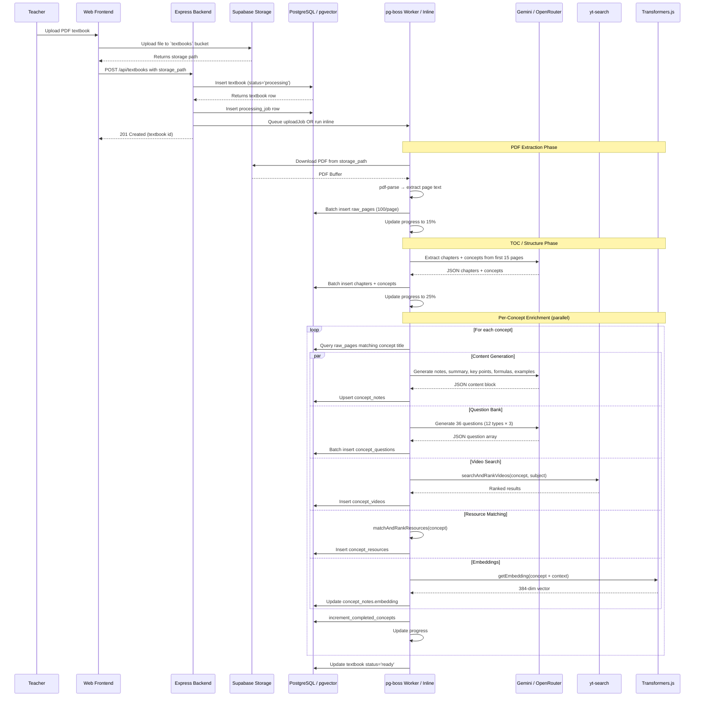

# Genesis LMS — Comprehensive System Design Document

> **Version:** 3.1.0  
> **Migration Status:** Backend ✅ Supabase | Web Frontend ✅ Supabase | Mobile App ✅ Supabase  
> **Stack:** Express.js + Supabase (PostgreSQL/pgvector) + React 18 (Vite 6) + Expo SDK 52  
> **Total Codebase:** ~200 source files, ~22,000 LOC across 3 applications

---

## Table of Contents

1. [Technology Stack](#1-technology-stack)
2. [High-Level Architecture](#2-high-level-architecture)
3. [Web Frontend (React)](#3-web-frontend-react)
4. [Mobile App (Expo/React Native)](#4-mobile-app-expo)
5. [Backend (Express.js)](#5-backend-expressjs)
6. [Database Architecture](#6-database-architecture)
7. [API Reference](#7-api-reference)
8. [Security Architecture](#8-security-architecture)
9. [Deployment Architecture](#9-deployment-architecture)
10. [AI Textbook Pipeline](#10-ai-textbook-pipeline)
11. [Development & Build](#11-development--build)
12. [Observations & Tech Debt](#12-observations--tech-debt)

---

## 1. Technology Stack

### 1.1 Per-Application Breakdown

| Layer | Web Frontend | Mobile App | Backend |
|-------|-------------|------------|---------|
| **Framework** | React 18 + Vite 6 + TypeScript 5.6 | Expo SDK 52 + React Native 0.76 | Express.js 4 + TypeScript 5.5 |
| **Auth** | `@supabase/supabase-js` ✅ | `@supabase/supabase-js` ✅ | Supabase Auth REST + Admin API (`database/auth.ts`) |
| **Database Client** | `@supabase/supabase-js` ✅ | `@supabase/supabase-js` ✅ | Custom `adapter.ts` (Firestore-compat over PostgreSQL) + `pg` (direct SQL) + pg-boss |
| **DB Engine** | Supabase PostgreSQL | Supabase PostgreSQL | Supabase PostgreSQL |
| **State** | Zustand 5 + TanStack React Query 5 | Zustand 5 | — |
| **HTTP** | Axios (JWT via Supabase session) | Axios (JWT via Supabase session) | Express routes (45 groups) |
| **Vector Search** | — | — | pgvector (384-dim, ivfflat) |
| **Job Queue** | — | — | pg-boss (optional, falls back inline) |
| **LLM** | — | — | Gemini API / OpenRouter |
| **Embeddings** | — | — | `@xenova/transformers` (all-MiniLM-L6-v2) |
| **Validation** | Zod + react-hook-form | — | Zod (16 validator files) |
| **Styling** | Tailwind CSS 3 + Radix UI + shadcn/ui | React Native + iOS/Android native | — |
| **Animations** | Framer Motion 11 | — | — |
| **Testing** | Vitest + Testing Library | None | Jest + ts-jest |
| **Deployment** | Vercel (static SPA) | App Stores | Vercel (serverless) |

### 1.2 Backend Dependencies (Production)

| Package | Purpose |
|---------|---------|
| `express` 4.21 | HTTP framework |
| `@supabase/supabase-js` | Supabase Auth + DB SDK |
| `pg` 8 | Direct PostgreSQL driver (for pg-boss, raw queries) |
| `pg-boss` 9 | Job queue on PostgreSQL |
| `zod` 3 | Schema validation |
| `@xenova/transformers` | Embeddings (all-MiniLM-L6-v2) |
| `cloudinary` 2 | Image upload/manipulation |
| `multer` 1 | File upload handling |
| `tesseract.js` 7 | OCR engine |
| `pdf-parse` 2 | PDF text extraction |
| `yt-search` 2 | YouTube video metadata search |
| `helmet` 7 | Security headers |
| `cors` 2 | CORS configuration |
| `express-rate-limit` 7 | Rate limiting |
| `winston` 3 | Logging |
| `morgan` 1 | HTTP request logging |
| `dotenv` 16 | Environment variables |
| `uuid` 11 | ID generation |

### 1.3 Web Frontend Dependencies (Production)

| Package | Purpose |
|---------|---------|
| `react` 18 + `react-dom` 18 | UI framework |
| `react-router-dom` 6 | Routing (createBrowserRouter) |
| `@tanstack/react-query` 5 | Server state cache |
| `zustand` 5 | Client state management |
| `axios` 1 | HTTP client |
| `@supabase/supabase-js` | Supabase client (Auth + direct DB) |
| `react-hook-form` 7 + `zod` 3 | Forms + validation |
| `framer-motion` 11 | Animations |
| `lucide-react` | Icons |
| `sonner` | Toast notifications |
| `date-fns` 4 | Date formatting |
| `react-helmet-async` | SEO / head management |
| Radix UI (12 primitives) | Accessible UI primitives |
| `tesseract.js` 7 | Client-side OCR |
| `pdfjs-dist` 6 | Client-side PDF text extraction |
| `katex` 0.17 | LaTeX rendering |

---

## 2. High-Level Architecture

### 2.1 Unified Architecture Diagram

```
┌──────────────────────────────────┐     ┌──────────────────────────────────┐
│         WEB FRONTEND             │     │          MOBILE APP             │
│  React 18 + Vite 6 + TypeScript │     │  Expo 52 + RN 0.76 + TypeScript  │
│  ┌────────────────────────────┐  │     │  ┌───────────────────────────┐   │
│  │ @supabase/supabase-js     │  │     │  │ @supabase/supabase-js    │   │
│  │ (Auth + direct DB reads)  │  │     │  │ (Auth + direct DB reads)  │   │
│  │ Axios → Bearer JWT        │  │     │  │ Axios → Bearer JWT        │   │
│  └────────────────────────────┘  │     │  └───────────────────────────┘   │
└────────────┬─────────────────────┘     └──────────────┬───────────────────┘
             │                                          │
             │ Axios + Bearer token                      │ Axios + Bearer token
             │ (same JWT from Supabase)                  │ (same JWT from Supabase)
             ▼                                          ▼
┌─────────────────────────────────────────────────────────────────────────────┐
│                         BACKEND (Express.js)                                │
│  ┌───────────┬───────────────┬──────────────┬────────────────┬───────────┐  │
│  │       Middleware Pipeline (order):        │                │           │  │
│  │  1. Helmet (security headers)            │ Controllers   │ Services  │  │
│  │  2. CORS                                 │ (44 files,    │ (49 files,│  │
│  │  3. express.json (100mb limit)           │  ~3,500 LOC)   │ ~8,000 LOC)│  │
│  │  4. Morgan (HTTP logging)                │                │           │  │
│  │  5. /api prefix remover                  │                │           │  │
│  │  6. Rate Limiting (4 tiers)              │                │           │  │
│  │  7. Routes (45 groups)                   │                │           │  │
│  │  8. Error Handler                        │                │           │  │
│  └───────────┴───────────────┴──────────────┴────────────────┴───────────┘  │
│                                                                             │
│  ┌──────────┬───────────┬───────────┬───────────┬────────────┬───────────┐  │
│  │ database/│ database/ │ database/ │ jobs/     │ validators │ utils/    │  │
│  │ adapter  │ auth.ts   │ admin.ts  │ (5 files) │ (16 files) │ (6 files) │  │
│  │ .ts      │           │           │ pg-boss   │ Zod schemas│ helpers   │  │
│  │ (492 LOC)│           │           │ workers   │            │           │  │
│  └──────────┴───────────┴───────────┴───────────┴────────────┴───────────┘  │
└─────────────────────────────────────────────────────────────────────────────┘
                               │
                               ▼
┌─────────────────────────────────────────────────────────────────────────────┐
│                     SUPABASE (Single Source of Truth)                       │
│                                                                             │
│  ┌──────────────────┐  ┌──────────────────┐  ┌──────────────────────────┐  │
│  │ Auth (JWT)       │  │ PostgreSQL 15    │  │ Storage                  │  │
│  │ - Session mgmt   │  │ - 11 typed tables│  │ - textbooks bucket       │  │
│  │ - Password reset  │  │ - nosql_docs     │  │ - avatars bucket         │  │
│  │ - Email confirm   │  │   (JSONB) 40+   │  │                          │  │
│  │                  │  │   collections    │  │                          │  │
│  │                  │  │ - pgvector       │  │                          │  │
│  │                  │  │   (384-dim,      │  │                          │  │
│  │                  │  │   ivfflat idx)   │  │                          │  │
│  └──────────────────┘  └──────────────────┘  └──────────────────────────┘  │
│                                                                             │
│  ┌──────────────────────────────────────────────────────────────────────┐  │
│  │ RLS Policies (10 typed tables)                                      │  │
│  │ - Admin: full access                                                │  │
│  │ - Teacher: own textbooks                                             │  │
│  │ - Student: textbooks matching class_ids                              │  │
│  │ Note: Backend bypasses RLS via service_role key                      │  │
│  └──────────────────────────────────────────────────────────────────────┘  │
└─────────────────────────────────────────────────────────────────────────────┘
```

### 2.2 Data Flow

```
[Web Client] ──→ supabase.auth.getSession() ──→ Supabase Auth
[Web Client] ──→ supabase.from('users').select() ──→ PostgreSQL (direct SDK)
[Web Client] ──→ Axios → Bearer JWT ──→ Express Middleware
                                          ├── auth.middleware → supabase.auth.getUser(token)
                                          ├── role.middleware → req.user.role check
                                          ├── validate.middleware → Zod schema
                                          └── controller → service → database/adapter → PostgreSQL

[Mobile Client] ──→ supabase.auth.getSession() ──→ Supabase Auth
[Mobile Client] ──→ supabase.from('users').select() ──→ PostgreSQL (direct SDK)
[Mobile Client] ──→ Axios → Bearer JWT ──→ Express Middleware (same path)

[Backend Internal] ──→ database/adapter.ts ──→ typed tables (SQL) or nosql_docs (JSONB)
[Backend Internal] ──→ pg-boss queue ──→ worker ──→ LLM + Transformers.js + yt-search + Tesseract.js
[Backend Internal] ──→ SUPABASE_SERVICE_ROLE_KEY (bypasses RLS)
```

### 2.3 Application Boundary Map

```
┌─────────────────────────────────────────────────────────────────────────┐
│  WHAT EACH CLIENT CAN DO DIRECTLY (via supabase SDK)                    │
│                                                                         │
│  Web Frontend │ Mobile App                                              │
│  ─────────────┼──────────                                                │
│  ✓ Auth ops   │ ✓ Auth ops              (login, signup, reset password) │
│  ✓ Read users │ ✓ Read users            (profile fetch, student roster) │
│  ✓ Read       │ ✓ Read                  (textbook content, chapters,    │
│    textbooks  │   textbooks               concepts, questions, videos)  │
│                                                                         │
│  WHAT REQUIRES THE BACKEND (via Axios)                                  │
│  ───────────────────────────────────────────────────────────────────────│
│  ✓ All CRUD on: classes, subjects, courses, assignments, exams,        │
│    quizzes, grades, attendance, notifications, messages, settings,      │
│    coding projects, mind maps, virtual labs, gamification, NEP          │
│    questions, OCR, textbooks (create/update/delete)                     │
│  ✓ AI Tutor chat, textbook pipeline (reprocess)                        │
│  ✓ Admin operations (user management, analytics, audit logs)           │
└─────────────────────────────────────────────────────────────────────────┘
```

---

## 3. Web Frontend (React)

### 3.1 Structure Overview

```
lms/frontend/src/
├── app/
│   ├── App.tsx                    # Root: AuthGate, QueryClient, ErrorBoundary, Toaster, Router
│   ├── components/
│   │   └── assessment/QuestionRendererV2.tsx
│   ├── layouts/
│   │   ├── AuthLayout.tsx          # Public pages (login, forgot/reset password)
│   │   ├── StudentLayout.tsx       # Student dashboard + navigation
│   │   ├── TeacherLayout.tsx       # Teacher dashboard + navigation
│   │   ├── AdminLayout.tsx         # Admin dashboard + navigation
│   │   ├── ParentLayout.tsx        # Parent dashboard + navigation
│   │   └── K2Layout.tsx            # Kindergarten (pre-primary) UI
│   ├── pages/                      # 65 page components
│   │   ├── auth/                   # Login, ForgotPassword, ResetPassword
│   │   ├── student/                # 28 pages (dashboard, exams, coding, labs, etc.)
│   │   ├── teacher/                # 28 pages (dashboard, textbooks, assessments, etc.)
│   │   ├── admin/                  # 13 pages (dashboard, classes, users, analytics)
│   │   ├── parent/                 # 5 pages (dashboard, children, reports)
│   │   └── shared/                 # NotFound, Welcome, Notifications, AboutSchool
│   └── router/
│       ├── index.tsx               # createBrowserRouter with nested layouts
│       └── ProtectedRoute.tsx      # Auth + role + setup guard
├── components/
│   ├── coding/                     # CodeEditor, StreamProjectCard
│   ├── common/                     # 15 shared components
│   ├── gamification/               # XPBar, BadgeCard, LeaderboardTable, etc.
│   ├── layout/                     # ThemeToggle, UserAvatar, NotificationBell
│   ├── mindmap/                    # MindMapBuilder (Canvas-based)
│   ├── nep-questions/              # NEPQuestionGenerator, RubricGenerator, etc.
│   ├── ocr/                        # CameraCapture, OCRResultDisplay
│   ├── student/                    # StudentHierarchyNav
│   ├── teacher/                    # QuestionRenderer, ConceptMindMap, etc.
│   ├── textbook/                   # UploadProgressBanner
│   ├── ui/                         # 23 shadcn/ui primitives (button, card, dialog, etc.)
│   └── virtual-labs/               # CircuitLab, MechanicsLab, ReactionLab, CellExplorer
├── features/
│   └── auth/                       # ForgotPasswordForm, ResetPasswordForm, useLogin, useRegister
├── services/                       # 30 service modules (see 3.2)
├── store/                          # 6 Zustand stores (see 3.3)
├── hooks/                          # useTranslation
├── i18n/                           # en.ts, hi.ts, te.ts
├── lib/                            # utils, format, constants, sanitize, pdfUtils, motion
├── types/                          # 20 type modules
└── utils/                          # Zod validation schemas
```

### 3.2 Service Modules

| Service | Key Functions | HTTP Endpoints |
|---------|--------------|---------------|
| `api.ts` | Axios instance with Bearer token interceptor + 401 refresh | — |
| `authService.ts` | login, register, logout, getCurrentUser, forgotPassword, resetPassword, verifyToken | `POST /auth/*`, `GET /auth/profile` |
| `aiService.ts` | sendChatMessage, extractChapters, generateConceptContentAndQuestions | `POST /ai/chat` |
| `textbookService.ts` | createTextbook, getTextbook, saveChapters, getChaptersForTextbook, getConceptsForChapter, reprocessTextbook | `POST/GET/DELETE /textbooks/*` |
| `dataService.ts` | getAllSubjects, getStudentsByClass, getClasses, getNotifications, getAssignments, getExams | `GET /subjects`, `GET /classes`, etc. |
| `offlineService.ts` | getContents, saveContent, syncAll, getStorageEstimate | — (IndexedDB/local) |
| `ocrService.ts` | scanImage, mapToConcept, pushQuiz, pushAssignment, sendChatMessage | `POST /ocr/*` |
| `userService.ts` | getUsers, createUser, updateUser, deleteUser, searchUsers | `GET/POST/PUT/DELETE /users/*` |
| `quizService.ts` | getQuizzes, createQuiz, submitAttempt, getResults | `GET/POST /quizzes/*` |
| `examService.ts` | getExams, createExam, submitAttempt, gradeExam | `GET/POST /exams/*` |
| `assignmentService.ts` | getAssignments, createAssignment, submitAssignment, gradeSubmission | `GET/POST /assignments/*` |
| `analyticsService.ts` | getDashboardStats, getTeacherAnalytics, getStudentPerformance | `GET /analytics/*` |
| `youtubeService.ts` | searchVideos, searchVideosForConcept | `GET /youtube/*` |
| `nepQuestionsService.ts` | generateQuestions, saveQuestions, generateRubric, generateFeedback | `POST /nep-questions/*` |
| `gamificationService.ts` | getProfile, getBadges, getLeaderboard, getDailyChallenges, awardXP | `GET/POST /gamification/*` |
| `codingService.ts` | getProjects, createProject, executeCode, getStreamProjects | `GET/POST /coding/*` |
| `mindmapService.ts` | getMindMaps, createMindMap, shareMindMap | `GET/POST/PUT /mindmaps/*` |
| `virtualLabsService.ts` | getLabs, getLab, saveProgress | `GET/POST /virtual-labs/*` |
| `attendanceService.ts` | markAttendance, getAttendanceByClass, getAttendanceByStudent | `POST/GET /attendance/*` |
| `feeService.ts` | createFeeSchedule, recordPayment, getOutstandingReport | `POST/GET /fee/*` |
| `schoolAnalyticsService.ts` | getOverview, getAcademicPerformance, getAttendanceStats | `GET /school-analytics/*` |
| `messagingService.ts` | getConversations, sendMessage, markRead | `GET/POST /messages/*` |
| `notificationService.ts` | getNotifications, markRead, getPreferences | `GET/PUT /notifications/*` |
| `settingsService.ts` | getSettings, updateSettings, getSystemSettings | `GET/PUT /settings/*` |
| `teacherClassSubjectService.ts` | assignTeacher, getTeacherSubjects, removeAssignment | `POST/GET/DELETE /teacher-class-subject/*` |
| `lessonService.ts` | getLessons, createLesson, markComplete | `GET/POST /lessons/*` |
| `courseService.ts` | getCourses, createCourse, enrollStudent | `GET/POST /courses/*` |
| `gradeService.ts` | getGradeSummary, addGrade, updateGrade | `GET/PUT /grades/*` |
| `prePrimaryService.ts` | getDashboard, getLessons, getFlashcards, getStories | `GET /pre-primary/*` |
| `parentService.ts` | getChildren, getChildDashboard, getChildReport | `GET /parent/*` |

### 3.3 Zustand Stores

| Store | Key | Persisted | State Shape |
|-------|-----|-----------|-------------|
| `authStore` | `lms-auth-v2` | Yes (AsyncStorage → Supabase session) | `{ user, token, isAuthenticated, isLoading }` |
| `uiStore` | `lms-ui` | Yes (localStorage) | `{ sidebarCollapsed, theme, activeModal }` |
| `languageStore` | `lms-language` | Yes (localStorage) | `{ language: 'en'\|'hi'\|'te' }` |
| `chatStore` | `lms-chat-storage` | Yes (localStorage) | `{ aiTutorMessages, studentOcrMessages, teacherOcrMessages }` |
| `notificationStore` | — | No | `{ unreadCount }` |
| `uploadStore` | — | No | `{ tasks: UploadTask[] }` |

### 3.4 Routing Structure

ProtectedRoute checks: isLoading → loading skeleton | !auth → redirect /login | wrong role → redirect to role dashboard | checkSetup → redirect /student/roll-number or /teacher/select-class

```
/                               → redirect /welcome
/welcome                        → WelcomePage (public)
/login                          → AuthLayout > LoginPage
/forgot-password                → ForgotPasswordForm
/reset-password                 → ResetPasswordForm

/student/roll-number            → RollNumberEntryPage (setup)
/teacher/select-class           → ClassSelectionPage (setup)

/student/*                      → ProtectedRoute(role=student) → StudentLayout
  /student/dashboard, /student/exams, /student/tasks, /student/profile,
  /student/ai-tutor, /student/gamification, /student/leaderboard,
  /student/labs, /student/labs/:id, /student/mindmaps, /student/mindmaps/:id,
  /student/coding, /student/coding/:id, /student/stream-projects,
  /student/ocr, /student/concepts/:conceptId,
  /assignments/:id, /quizzes/:id/attempt, /exams/:id,
  /student/assessments/:assessmentId/take

/k2/*                           → ProtectedRoute(role=student) → K2Layout
  /k2/dashboard, /k2/tracing, /k2/phonics, /k2/stories,
  /k2/flashcards, /k2/flashcards/:category

/teacher/*                      → ProtectedRoute(role=teacher) → TeacherLayout
  /teacher/dashboard, /teacher/students, /teacher/students/:id,
  /teacher/assessments, /teacher/exams, /teacher/exams/create,
  /teacher/exams/:id/correct, /teacher/classes/:id, /teacher/classes/:classId/subjects/:subjectId,
  /teacher/textbooks, /teacher/textbooks/:textbookId, /teacher/textbooks/upload,
  /teacher/textbooks/:textbookId/chapters/:chapterId/concepts/:conceptId,
  /teacher/profile, /teacher/videos, /teacher/analytics,
  /teacher/attendance, /teacher/mindmaps, /teacher/mindmaps/:id,
  /teacher/nep-questions, /teacher/rubrics, /teacher/ocr,
  /teacher/release-grades, /teacher/question-bank, /teacher/question-papers,
  /teacher/test-templates, /teacher/test-schedule, /teacher/pyq

/admin/*                        → ProtectedRoute(role=super_admin|admin) → AdminLayout
  /admin/dashboard, /admin/classes, /admin/students, /admin/teachers,
  /admin/subjects, /admin/settings, /admin/profile/edit,
  /admin/school-analytics, /admin/attendance, /admin/fee,
  /admin/users, /admin/audit-logs, /admin/academic-years

/parent/*                       → ProtectedRoute(role=parent) → ParentLayout
  /parent/dashboard, /parent/children, /parent/children/:studentId,
  /parent/reports, /parent/profile
```

---

## 4. Mobile App (Expo)

### 4.1 Structure Overview

```
lms/mobile/src/
├── navigation/
│   ├── AppNavigator.tsx       # NavigationContainer → RootStack → AuthStack / Role stacks
│   └── types.ts               # Param list types for all stacks
├── screens/                   # 7 screens
│   ├── auth/LoginScreen.tsx
│   ├── student/StudentDashboardScreen.tsx, StudentTasksScreen.tsx, StudentExamsScreen.tsx
│   ├── teacher/TeacherDashboardScreen.tsx
│   ├── admin/AdminDashboardScreen.tsx
│   └── shared/NotFoundScreen.tsx
├── components/
│   ├── LoadingSpinner.tsx
│   └── ErrorMessage.tsx
├── services/
│   ├── authService.ts         # login, logout, getCurrentUser, forgotPassword → Supabase
│   └── api.ts                 # Axios instance + Bearer token + 401 refresh
├── store/
│   └── authStore.ts           # Zustand + persist (AsyncStorage key: lms-auth-v2)
├── supabase/
│   └── config.ts              # createClient() with AsyncStorage
├── hooks/
│   └── useAuth.ts             # Initializes auth store on mount
├── types/
│   └── index.ts               # UserProfile, UserRole, ApiResponse, etc.
└── utils/
    └── constants.ts           # API_BASE_URL, ROLE_HIERARCHY, ROUTE_NAMES
```

### 4.2 Navigation Flow

```
NavigationContainer
└── RootStack (native-stack, headerShown: false)
    ├── [unauthenticated] "Auth" → AuthStack → "Login" → LoginScreen
    ├── [role=student]   "Student" → StudentStack (3 screens)
    ├── [role=teacher]   "Teacher" → TeacherStack (1 screen)
    ├── [role=admin]     "Admin" → AdminStack (1 screen)
    └── "NotFound" → NotFoundScreen
```

### 4.3 Auth Flow

```
1. useAuth() hook calls authStore.initialize()
2. initialize() → supabase.auth.getSession()
3. If session exists:
   a. Set token from session.access_token
   b. Fetch profile: supabase.from('users').select('*').eq('id', session.user.id).single()
   c. Map snake_case DB columns to camelCase UserProfile
4. Subscribe to supabase.auth.onAuthStateChange → update store on changes
5. Persist token + user to AsyncStorage via Zustand partialize
```

---

## 5. Backend (Express.js)

### 5.1 Entry Points

**`src/index.ts`** — Server startup:
- Imports `app` from `./app`
- Reads `env` from `./config/env`
- Starts scheduler (`startScheduler`) and workers (`startWorkers`) *after* server listens
- Registers error handlers: `uncaughtException`, `unhandledRejection`, `SIGTERM`, `SIGINT`

**`src/app.ts`** — Express app assembly:
```
Middleware pipeline (in order):
1. trust proxy (1 hop)
2. securityHeaders (helmet)
3. CORS (FRONTEND_URL origin)
4. express.json (100mb limit) + urlencoded
5. morgan combined (NODE_ENV !== 'test')
6. /api prefix remover
7. apiRateLimit → routes
8. errorHandler
```

### 5.2 Middleware

| Middleware | File | Exports | Purpose |
|-----------|------|---------|---------|
| Auth | `middlewares/auth.middleware.ts` | `authenticate`, `optionalAuth` | Verifies JWT via `supabase.auth.getUser(token)` |
| Role | `middlewares/role.middleware.ts` | `requireRole(...roles)`, `requireOwnershipOrRole(...)` | Checks `req.user.role` against allowed roles |
| Validate | `middlewares/validate.middleware.ts` | `validate(schema, target)` | Validates `body`/`query`/`params` against Zod schema |
| Rate Limit | `middlewares/rateLimit.middleware.ts` | `authRateLimit` (20/15m), `apiRateLimit` (200/m), `uploadRateLimit` (5/m), `strictRateLimit` (20/15m) | In-memory rate limiting |
| Error | `middlewares/error.middleware.ts` | `errorHandler` | Catches errors, returns `{ success: false, error }` |
| Security | `middlewares/securityHeaders.middleware.ts` | `securityHeaders` | Helmet middleware configuration |
| Async | `middlewares/asyncHandler.ts` | `asyncHandler(fn)` | Wraps async route handlers to catch promise rejections |

### 5.3 Route Map (45 Route Groups)

| Prefix | Routes File | Auth | Key Methods |
|--------|------------|------|------------|
| `/auth` | `auth.routes.ts` | Rate limit on register/login | register, login, profile, logout |
| `/users` | `user.routes.ts` | Admin | CRUD, toggleActive, assignRole |
| `/classes` | `class.routes.ts` | Admin | CRUD, add/remove students, roster |
| `/subjects` | `subject.routes.ts` | Mixed | CRUD (admin), list (authenticated) |
| `/courses` | `course.routes.ts` | Teacher/Admin | CRUD, enroll/unenroll |
| `/lessons` | `course.routes.ts` → nested | Teacher/Admin | CRUD, reorder, markComplete |
| `/assignments` | `assignment.routes.ts` | Teacher/Admin/Student | CRUD, submit, grade |
| `/assignments-v2` | `assignment-v2.routes.ts` | Teacher/Admin/Student | v2 CRUD, release, grades |
| `/quizzes` | `quiz.routes.ts` | Teacher/Admin/Student | CRUD, attempt, results |
| `/quizzes-v2` | `quiz-v2.routes.ts` | Teacher/Admin/Student | v2 CRUD, release, republish |
| `/exams` | `exam.routes.ts` | Teacher/Admin/Student | CRUD, schedule, attempt, grade |
| `/exams-v2` | `exam-v2.routes.ts` | Teacher/Admin/Student | v2 CRUD, proctoring, results |
| `/grades` | `grade.routes.ts` | Teacher/Admin | gradebook, student grades, report |
| `/messages` | `message.routes.ts` | Authenticated | conversations, send, read |
| `/notifications` | `notification.routes.ts` | Authenticated | CRUD, preferences |
| `/analytics` | `analytics.routes.ts` | Role-based | Dashboard stats per role |
| `/analytics-v2` | `analytics-v2.routes.ts` | Teacher/Admin | Class performance, oversight |
| `/textbooks` | `textbook.routes.ts` | Mixed | CRUD, chapters, concepts, reprocess |
| `/youtube` | `youtube.routes.ts` | Authenticated | search, searchForConcept |
| `/ai` | `ai.routes.ts` | Authenticated (strict rate limit) | chat |
| `/upload` | `upload.routes.ts` | Teacher/Admin | file delete |
| `/settings` | `settings.routes.ts` | Admin | system settings |
| `/jobs` | `jobs.routes.ts` | Admin + cron hooks | reminders, cleanup |
| `/audit-logs` | `audit.routes.ts` | Admin | list, recover |
| `/whiteboard` | `concept.routes.ts` | Teacher | get/save whiteboard |
| `/teacher-class-subject` | `teacher-class-subject.routes.ts` | Admin/Teacher | assign, setup, list |
| `/teacher-videos` | `teacher-video.routes.ts` | Teacher | CRUD, attach to concept |
| `/academic-years` | `academic-year.routes.ts` | Admin | CRUD |
| `/enrollments` | `enrollment.routes.ts` | Authenticated | my enrollments |
| `/gamification` | `gamification.routes.ts` | Authenticated | profile, badges, leaderboard, challenges |
| `/parent` | `parent.routes.ts` | Parent | children, reports |
| `/mindmaps` | `mindmap.routes.ts` | Authenticated | CRUD, share, pin resource |
| `/attendance` | `attendance.routes.ts` | Teacher/Admin | mark, report, export CSV |
| `/fee` | `fee.routes.ts` | Admin | schedules, payments, reports |
| `/school-analytics` | `school-analytics.routes.ts` | Admin | overview, trends |
| `/pre-primary` | `pre-primary.routes.ts` | Mixed | K2 dashboard, lessons, flashcards |
| `/virtual-labs` | `virtual-labs.routes.ts` | Authenticated | CRUD, progress |
| `/coding` | `coding.routes.ts` | Authenticated | projects, executeCode, stream projects |
| `/nep-questions` | `nep-questions.routes.ts` | Teacher | generate, save, rubrics, feedback |
| `/ocr` | `ocr.routes.ts` | Authenticated (upload rate limit) | scan, chat, push quiz/assignment |
| `/question-bank` | `question-bank.routes.ts` | Teacher | CRUD, import from concept |
| `/question-papers` | `question-paper.routes.ts` | Teacher | CRUD |
| `/test-templates` | `test-template.routes.ts` | Teacher | CRUD, compile |
| `/test-schedule` | `test-schedule.routes.ts` | Teacher | CRUD, approve |
| `/results-push` | `results-push.routes.ts` | Teacher | release batch/single |

Total: **~180+ distinct API endpoints** across 45 route groups.

### 5.4 Service Layer (49 Files, ~8,000 LOC)

Services are organized by domain. Each service file exports a `const xxxService = { ... }` object or standalone functions. Domains:

| Domain | Services | Notable Functions |
|--------|----------|-------------------|
| **Auth/Users** | `auth.service.ts`, `user.service.ts` | register, login, verifyToken, createUser, assignRole |
| **AI/ML** | `ai.service.ts`, `transformers.service.ts`, `ai-level.service.ts` | chatCompletion, getEmbedding, computeLevel |
| **Academic** | `academic-year.service.ts`, `class.service.ts`, `subject.service.ts`, `course.service.ts`, `lesson.service.ts` | CRUD for core academic entities |
| **Assessments** | `assignment.service.ts`, `assignment-v2.service.ts`, `quiz.service.ts`, `quiz-v2.service.ts`, `exam.service.ts`, `exam-v2.service.ts` | Create, release, attempt, grade, results |
| **Textbook** | `textbook.service.ts`, `pipeline.service.ts` | CRUD, reprocess, pipeline coordination |
| **Content Enrichment** | `video-ranker.service.ts`, `resource-ranker.service.ts`, `teacher-video.service.ts`, `youtube.service.ts` | Search, rank, attach to concepts |
| **Vocabulary/Language** | `nep-questions.service.ts`, `ocr.service.ts`, `question-bank.service.ts`, `question-paper.service.ts` | NEP question generation, OCR processing |
| **Analytics** | `analytics.service.ts`, `analytics-v2.service.ts`, `school-analytics.service.ts` | Dashboards, performance tracking |
| **Communication** | `message.service.ts`, `notification.service.ts` | Messaging, notifications, preferences |
| **Gamification** | `gamification.service.ts` | XP, badges, leaderboard, streaks |
| **Finance** | `fee.service.ts` | Fee schedules, payments, reports |
| **Admin** | `settings.service.ts`, `audit.service.ts`, `teacher-class-subject.service.ts` | System settings, audit logs, teacher assignments |
| **Creative** | `mindmap.service.ts`, `virtual-labs.service.ts`, `coding.service.ts`, `pre-primary.service.ts` | Mind maps, virtual labs, coding, K2 activities |
| **Impact** | `impact.service.ts` | Dependency checks before deletion (prevents orphaned data) |

### 5.5 Job System (pg-boss)

| File | Exports | Schedule | Description |
|------|---------|----------|-------------|
| `jobs/queue.ts` | `addUploadJob`, `removeUploadJob`, `getBoss` | — | pg-boss queue management for textbook pipeline |
| `jobs/worker.ts` | `runUploadPipeline`, `startWorkers` | On-demand | Full textbook processing pipeline |
| `jobs/scheduler.ts` | `startScheduler`, `stopScheduler` | 5m/30m/6h | Registers 3 cron jobs |
| `jobs/sendReminders.job.ts` | `checkUpcomingDeadlines` | Every 30min | Sends notifications for upcoming deadlines |
| `jobs/cleanupExpired.job.ts` | `cleanupExpiredData` | Every 60min | Cleans expired tokens, abandoned attempts |

**Textbook Pipeline Flow (in `worker.ts`):**
1. Download PDF from Supabase Storage
2. `pdf-parse` → extract page text → batch insert `raw_pages`
3. LLM: extract chapters + concepts from first 15 pages
4. Per-concept enrichment (parallel):
   - AI content generation (notes, summary, key points, formulas, examples)
   - AI question bank (36 questions, 12 types × 3)
   - YouTube video search + ranking
   - Resource matching + ranking
   - Embedding generation (384-dim via Transformers.js)
5. Update textbook status to `ready`

### 5.6 Controllers (44 Files, ~3,500 LOC)

Each controller:
1. Extracts validated data from `req` (body, params, query, user)
2. Delegates to the corresponding service
3. Wraps in try/catch with `asyncHandler`
4. Returns `res.json({ success: true, data })` or passes error to `errorHandler`

### 5.7 Validators (16 Files)

Zod schemas per domain:
- Input validation: `signUpSchema`, `signInSchema`, `createClassSchema`, `createExamSchema`,
  `sendMessageSchema`, `generateQuestionsSchema`, etc.
- Query validation: `classQuerySchema`, `courseQuerySchema`, `userQuerySchema`, `subjectQuerySchema`, etc.
- File upload via multer, validated by middleware

### 5.8 Utils (6 Files)

| File | Exports |
|------|---------|
| `utils/logger.ts` | Winston logger (console + file transports) |
| `utils/pagination.ts` | Pagination helper (page, limit, offset, total) |
| `utils/response.ts` | Standardized response helpers |
| `utils/batchProcessor.ts` | Batch processing with concurrency control |
| `utils/textUtils.ts` | Text chunking, cleaning utilities |
| `utils/validationUtils.ts` | Shared validation helpers |

---

## 6. Database Architecture

### 6.1 Hybrid SQL/NoSQL Model

The database uses a dual model on a single PostgreSQL 15 instance powered by Supabase:

```
                    ┌─────────────────────────────────────────────┐
                    │         PostgreSQL 15 (Supabase)            │
                    │                                             │
                    │  ┌─────────────────────────────────────┐    │
                    │  │  Typed Tables (Strict Schema)        │    │
                    │  │                                     │    │
                    │  │ users → textbooks → chapters →      │    │
                    │  │   concepts → concept_notes           │    │
                    │  │            → concept_questions       │    │
                    │  │            → concept_videos          │    │
                    │  │            → concept_resources       │    │
                    │  │   raw_pages, processing_jobs         │    │
                    │  └─────────────────────────────────────┘    │
                    │                                             │
                    │  ┌─────────────────────────────────────┐    │
                    │  │  JSONB Document Store (nosql_docs)   │    │
                    │  │  (collection, doc_id, data JSONB)    │    │
                    │  │  40+ collections: classes, subjects, │    │
                    │  │  courses, lessons, assignments,      │    │
                    │  │  exams, quizzes, grades, messages,   │    │
                    │  │  notifications, etc.                 │    │
                    │  └─────────────────────────────────────┘    │
                    │                                             │
                    │  ┌─────────────────────────────────────┐    │
                    │  │  pgvector (384-dim)                 │    │
                    │  │  concept_notes.embedding            │    │
                    │  │  concept_videos.embedding           │    │
                    │  │  concept_resources.embedding        │    │
                    │  └─────────────────────────────────────┘    │
                    └─────────────────────────────────────────────┘
```

### 6.2 Typed Tables (11 Tables)

| Table | Schema | Key Columns | FK Dependencies |
|-------|--------|-------------|----------------|
| `users` | Fixed + `data JSONB` | `id UUID PK`, `email`, `display_name`, `role`, `class_ids TEXT[]`, `class_id`, `student_id`, `is_active`, `photo_url`, `streak_count`, `language`, `children_ids TEXT[]` | — |
| `textbooks` | Fixed + `data JSONB` | `id UUID PK`, `title`, `subject_id`, `class_id`, `teacher_id FK→users`, `status` (processing/ready/failed), `storage_path`, `chapter_count`, `total_concepts`, `completed_concepts`, `logs TEXT[]` | users |
| `chapters` | Fixed + `data JSONB` | `id UUID PK`, `textbook_id FK→textbooks`, `title`, `order`, `summary` | textbooks |
| `concepts` | Fixed + `data JSONB` | `id UUID PK`, `chapter_id FK→chapters`, `textbook_id FK→textbooks`, `title`, `order`, `video_links TEXT[]` | chapters, textbooks |
| `concept_notes` | Fixed + `data JSONB` | `id UUID PK`, `concept_id FK UNIQUE→concepts`, `textbook_id`, `chapter_id`, `summary`, `notes`, `key_points`, `formulas`, `examples`, `learning_objectives`, `embedding VECTOR(384)` | concepts (unique) |
| `concept_videos` | Fixed + `data JSONB` | `id UUID PK`, `concept_id FK→concepts`, `textbook_id`, `chapter_id`, `video_id`, `title`, `description`, `channel`, `duration`, `score REAL`, `embedding VECTOR(384)` | concepts |
| `concept_questions` | Fixed + `data JSONB` | `id UUID PK`, `concept_id FK→concepts`, `textbook_id`, `chapter_id`, `question`, `type`, `difficulty`, `options TEXT[]`, `answer`, `explanation`, `passage_text` | concepts |
| `concept_resources` | Fixed + `data JSONB` | `id UUID PK`, `concept_id FK→concepts`, `textbook_id`, `chapter_id`, `title`, `url`, `source`, `description`, `score REAL`, `embedding VECTOR(384)` | concepts |
| `processing_jobs` | Fixed | `id UUID PK`, `textbook_id FK UNIQUE→textbooks`, `status` (PROCESSING/COMPLETED/FAILED), `progress`, `current_step`, `error` | textbooks (unique) |
| `raw_pages` | Fixed | `id UUID PK`, `textbook_id FK→textbooks`, `page_num`, `text` | textbooks |
| `nosql_docs` | JSONB-only | `collection TEXT`, `doc_id TEXT`, `data JSONB`, `created_at`, `updated_at` | — |

### 6.3 JSONB Document Store (nosql_docs)

**40+ collections** stored in a single `nosql_docs` table with composite primary key `(collection, doc_id)`:

`classes`, `subjects`, `courses`, `lessons`, `assignments`, `quizzes`, `exams`, `grades`, `notifications`, `messages`, `conversations`, `timetable`, `enrollments`, `auditLogs`, `settings`, `questionBank`, `testTemplates`, `gamificationProfiles`, `gamificationTransactions`, `gamificationDailyChallenges`, `mindmaps`, `virtualLabs`, `virtualLabProgress`, `attendance`, `feeSchedules`, `payments`, `codingProjects`, `streamProjects`, `prePrimaryLessons`, `flashcards`, `stories`, `tracingActivities`, `prePrimaryProgress`, `nepQuestions`, `gradingRubrics`, `quizV2`, `quizAttemptV2`, `assignmentV2`, `assignmentSubmissionV2`, `examV2`, `examAttemptV2`, `teacherVideos`, `teacherClassSubject`, `academicYears`, `uploads`, `tokens`, `activityLogs`, `questionPapers`, `testSchedule`, `nepFeedback`

### 6.4 Database Adapter (`src/database/adapter.ts` — 492 lines)

A **Firestore-compatible API over PostgreSQL** that enables the codebase to use Firestore-like syntax while reading/writing to either typed tables or `nosql_docs`:

**Core Classes:**
- `DocRef` — document reference: `.get()`, `.set()`, `.update()`, `.delete()`, `.collection(sub)`
- `ColRef` — collection reference: `.doc()`, `.add()`, `.where()`, `.orderBy()`, `.limit()`, `.offset()`, `.get()`, `.count()`
- `Query` — chained query builder: `where()`, `orderBy()`, `limit()`, `offset()`, `count()`, `get()`
- `DocSnap` / `QuerySnap` — result wrappers with `.data()`, `.exists`, `.docs`
- `WB` (WriteBatch) — `set()`, `create()`, `update()`, `delete()`, `commit()` (sequential, not atomic)
- `Tx` (Transaction) — `get()`, `set()`, `update()`, `delete()`, `commit()` (sequential)

**Key Exports:**
- `getDb()` — returns Firestore-compatible root
- `getCollection(name)` — returns `ColRef`
- `collections` — 56 named collection shortcuts
- `FieldValue` — sentinels: `increment`, `arrayUnion`, `arrayRemove`, `serverTimestamp`, `deleteField`
- `Timestamp` — `now()`, `fromDate()`, `toDate()`

**Routing Logic:**
- Typed collections (`users`, `textbooks`, `chapters`, `concepts`, `concept_notes`, `concept_videos`, `concept_questions`, `concept_resources`, `processing_jobs`, `raw_pages`) → direct SQL on typed table
- All other collections → `nosql_docs` JSONB table
- Sub-collections → FK-filtered queries (e.g., `textbooks/{id}/chapters` → `WHERE textbook_id = {id}`)
- camelCase ↔ snake_case with acronym support (`photoURL` ↔ `photo_url`)

### 6.5 pgvector Search

| Table | Vector Column | Index Type | Operator |
|-------|--------------|------------|----------|
| `concept_notes` | `embedding VECTOR(384)` | ivfflat (lists=100) | vector_cosine_ops |
| `concept_videos` | `embedding VECTOR(384)` | ivfflat (lists=100) | vector_cosine_ops |
| `concept_resources` | `embedding VECTOR(384)` | ivfflat (lists=100) | vector_cosine_ops |

**Search Function:** `pgvector_search(query_embedding, match_threshold, match_count, input_concept_id)`:
- Returns cosine-similarity ranked results from `concept_videos`
- Optional `concept_id` filter
- Threshold-based matching (default 0.5)
- Embeddings generated by `@xenova/transformers` (all-MiniLM-L6-v2)

### 6.6 Indexes

**B-tree (11 indexes):**
- `idx_textbooks_teacher_id`, `idx_textbooks_status`
- `idx_chapters_textbook_id`
- `idx_concepts_chapter_id`, `idx_concepts_textbook_id`
- `idx_concept_notes_concept_id`
- `idx_concept_videos_concept_id`
- `idx_concept_questions_concept_id`
- `idx_concept_resources_concept_id`
- `idx_processing_jobs_textbook_id`
- `idx_raw_pages_textbook_id`
- `idx_nosql_docs_collection`

**pgvector ivfflat (3 indexes):**
- `idx_concept_notes_embedding` (lists=100)
- `idx_concept_videos_embedding` (lists=100)
- `idx_concept_resources_embedding` (lists=100)

### 6.7 RPC Functions

| Function | Purpose |
|----------|---------|
| `public.get_user_role()` | SECURITY DEFINER, reads role from `users` table by `auth.uid()` — avoids RLS recursion |
| `public.increment_completed_concepts(t_id UUID)` | Atomic increment of `textbooks.completed_concepts` |
| `public.pgvector_search(...)` | Cosine-similarity vector search with optional concept filter |

### 6.8 Row-Level Security

**RLS enabled on:** `users`, `textbooks`, `chapters`, `concepts`, `concept_questions`, `concept_videos`, `concept_notes`, `concept_resources`, `processing_jobs`, `raw_pages`

**Not enabled on:** `nosql_docs`

**Policies:**
- Admins have full access to all typed tables
- Authenticated users can read all profiles (`users`)
- Teachers can manage own textbooks (`auth.uid() = teacher_id`)
- Students can read textbooks where `class_id` is in their `class_ids`
- Students can read chapters/concepts/questions/videos/notes/resources if textbook is visible

**Critical:** Backend uses `SUPABASE_SERVICE_ROLE_KEY` which **bypasses RLS entirely**. RLS only protects against direct SDK access from clients.

---

## 7. API Reference

### 7.1 Standard Response Format

```json
// Success
{ "success": true, "data": { ... } }

// Error
{ "success": false, "error": "Message", "code": "VALIDATION_ERROR" }

// Paginated
{ "success": true, "data": [...], "pagination": { "page": 1, "limit": 20, "total": 100, "totalPages": 5, "hasNext": true, "hasPrev": false } }
```

### 7.2 Authentication Headers

```
Authorization: Bearer <supabase_jwt>
```

### 7.3 Status Codes

| Code | Usage |
|------|-------|
| 200 | Success |
| 201 | Created |
| 400 | Validation error |
| 401 | Missing/invalid token |
| 403 | Insufficient role |
| 404 | Resource not found |
| 409 | Conflict (duplicate) |
| 429 | Rate limited |
| 500 | Server error |

### 7.4 Key Endpoints Summary

| Cluster | Endpoints | Methods |
|---------|-----------|---------|
| Auth | `/auth/*` | 10 endpoints (register, login, profile, password) |
| Users | `/users/*` | 12 endpoints (CRUD, toggle, role, strengths) |
| Classes | `/classes/*` | 8 endpoints (CRUD, students, roster) |
| Subjects | `/subjects/*` | 6 endpoints (CRUD, by-class) |
| Courses | `/courses/*` | 8 endpoints (CRUD, enroll) |
| Lessons | `/lessons/*` | 7 endpoints (CRUD, reorder, complete) |
| Assignments | `/assignments/*` | 11 endpoints (v1+v2 combined) |
| Quizzes | `/quizzes*` | 22 endpoints (v1+v2 combined) |
| Exams | `/exams*` | 22 endpoints (v1+v2 combined) |
| Grades | `/grades/*` | 5 endpoints (gradebook, report) |
| Textbooks | `/textbooks/*` | 8 endpoints (CRUD, chapters, concepts, reprocess) |
| Analytics | `/analytics*` | 9 endpoints (v1+v2 combined) |
| OCR | `/ocr/*` | 7 endpoints (scan, chat, push) |
| Gamification | `/gamification/*` | 16 endpoints (profile, badges, leaderboard) |
| Messages | `/messages/*` | 5 endpoints (conversations, send) |
| Notifications | `/notifications/*` | 7 endpoints (CRUD, preferences) |
| Admin | `/settings/*`, `/audit-logs/*`, `/jobs/*` | 12 endpoints |
| etc. | ~30 more route groups | 2-5 endpoints each |

---

## 8. Security Architecture

### 8.1 Defense in Depth

```
Layer 1: Helmet (security headers — CSP, X-Frame-Options, HSTS, etc.)
Layer 2: CORS (restricted to FRONTEND_URL origin)
Layer 3: Rate Limiting (4 tiers with exponentially increasing backoff)
Layer 4: JWT Authentication (auth.middleware → supabase.auth.getUser())
Layer 5: Role Authorization (role.middleware → requireRole())
Layer 6: Zod Input Validation (validate.middleware on all mutation endpoints)
Layer 7: Audit Logging (audit.service.ts on all sensitive mutations)
Layer 8: Row-Level Security (PostgreSQL — bypassed by service role key)
```

### 8.2 Rate Limiting Tiers

| Tier | Window | Max Requests | Applied To |
|------|--------|-------------|------------|
| Global | 1 minute | 200 | All API routes |
| Auth | 15 minutes | 20 | `/auth/register`, `/auth/login`, `/auth/forgot-password` |
| AI | 15 minutes | 20 | `/ai/chat` |
| Upload | 1 minute | 5 | `/ocr/scan`, `/ocr/scan-multiple` |

### 8.3 Threat Model

| Threat | Mitigation | Residual Risk |
|--------|-----------|---------------|
| JWT theft | Short expiry (1h), refresh token rotation | None if HTTPS is enforced |
| Service role key leak | Backend compromise = full DB access | **High** — key in `.env`, no rotation |
| SQL injection | Parameterized queries via adapter | None |
| XSS | Helmet CSP, React's built-in escaping, sanitize.ts | Low |
| CSRF | CORS restricted, JWT not cookie-based | None |
| Rate limit bypass | In-memory (single process), Vercel scale | Medium — resets if instance dies |
| Unauthenticated RLS bypass | Backend uses service_role_key | **Medium** — client SDK is properly restricted |

### 8.4 Secrets Management

Credentials stored in `.env` (not in source control):
```
SUPABASE_URL, SUPABASE_ANON_KEY, SUPABASE_SERVICE_ROLE_KEY
DATABASE_URL (connection string with password)
GEMINI_API_KEY (or AI_API_KEY for OpenRouter)
CLOUDINARY_API_KEY, CLOUDINARY_API_SECRET
YOUTUBE_API_KEY
```

---

## 9. Deployment Architecture

### 9.1 Current Setup

```
┌─────────────────────┐     ┌─────────────────────┐     ┌─────────────────────┐
│     Vercel          │     │     Vercel          │     │     Supabase        │
│  Web Frontend       │     │  Backend (API)      │     │  Managed Cloud      │
│  ┌───────────────┐  │     │  ┌───────────────┐  │     │  ┌───────────────┐  │
│  │ Static SPA    │  │     │  │ Express.js    │  │     │  │ PostgreSQL    │  │
│  │ (Vite build)  │──┼─────┼─>│ serverless    │──┼─────┼─>│ + pgvector    │  │
│  │               │  │     │  │ (api/index.ts)│  │     │  │               │  │
│  │ /api → proxy  │  │     │  │ timeout: 10s  │  │     │  │ Auth + Storage│  │
│  └───────────────┘  │     │  └───────────────┘  │     │  └───────────────┘  │
└─────────────────────┘     └─────────────────────┘     └─────────────────────┘
                                                                 ▲
                                                                 │
┌─────────────────────┐                                          │
│  Vercel (optional)  │                                          │
│  pg-boss Worker     │── Direct PostgreSQL via `pg` driver ─────┘
│  (long-running)     │
│  - Textbook pipeline│
│  - Reminders        │
│  - Cleanup          │
└─────────────────────┘
```

### 9.2 Recommendations for Production

| Issue | Recommendation | Priority |
|-------|---------------|----------|
| 10s Vercel serverless timeout | Run pg-boss workers on dedicated host (Render, Railway, or ECS) | High |
| Single pg-boss worker blocks | Scale horizontally (pg-boss supports concurrent workers) | Medium |
| Inline pipeline blocks HTTP | Always use pg-boss in production; never fall back inline | High |
| Transformers.js blocks event loop | Offload to worker thread (`worker_threads`) or external embedding API | Medium |
| LLM rate limit stalls | Add circuit breaker with longer delays and queue depth management | Medium |
| No caching | Add Redis for session cache, LLM response cache, rate-limit state | Medium |
| nosql_docs JSONB queries | Add GIN indexes on frequently-queried `data->>path` fields | Low |
| In-memory analytics | Replace with materialized views + rollup tables for large datasets | Low |
| Static env variables | Use Vercel environment variables (not .env) for secrets | High |
| No health checks | Add `/health` with DB ping + pg-boss status | Low |

---

## 10. AI Textbook Pipeline

### 10.1 Pipeline Sequence



### 10.2 Key Pipeline Details

| Phase | Input | Processing | Output | Model Used |
|-------|-------|-----------|--------|------------|
| PDF Extraction | PDF buffer | `pdf-parse` | `raw_pages` (text) | — |
| TOC Extraction | First 15 pages text | Gemini API | Chapters + concepts JSON | gemini-2.0-flash |
| Content Gen | Concept + page text | Gemini API | Notes, summary, key points, formulas, examples | gemini-2.0-flash |
| Question Gen | Concept + page text | Gemini API | 36 questions (12 types × 3 difficulty levels) | gemini-2.0-flash |
| Video Search | Concept title | `yt-search` API | Ranked YouTube videos | — |
| Resource Match | Concept title | Keyword + TF-IDF | Ranked educational resources | — |
| Embeddings | Concept title + context | `@xenova/transformers` | 384-dim vector (all-MiniLM-L6-v2) | Transformers.js |

---

## 11. Development & Build

### 11.1 Commands

| Application | Start | Build | Test | TypeCheck |
|------------|-------|-------|------|-----------|
| Backend | `npm run dev` (tsx watch) | `npm run build` (tsc) | `npm test` (Jest) | `tsc --noEmit` |
| Web Frontend | `npm run dev` (Vite) | `npm run build` (Vite) | `npm test` (Vitest) | `tsc --noEmit` |
| Mobile | `npx expo start` | `npx expo export` | — | `tsc --noEmit` |

### 11.2 Project Structure

```
lms/
├── frontend/           # React SPA (Vite)
│   ├── src/            # ~14,000 LOC
│   ├── index.html
│   ├── vite.config.ts
│   └── package.json
├── backend/            # Express.js API
│   ├── src/            # ~18,550 LOC (199 .ts files)
│   ├── supabase/
│   │   └── schema.sql  # Full database schema
│   ├── jest.config.ts
│   └── package.json
├── mobile/             # Expo React Native
│   ├── src/            # ~2,000 LOC (17 files)
│   ├── app.json
│   └── package.json
└── docs/
    └── system-design.md
```

### 11.3 Vite Config (Web Frontend)

- Proxy: `/api` → `http://localhost:3001`
- Port: 5173
- Code splitting: `vendor` (react/react-dom/router) + `supabase` chunks
- Aliases: `@` → `./src`

### 11.4 TanStack React Query Defaults (Web Frontend)

- `staleTime`: 5 minutes
- `gcTime`: 10 minutes
- `retry`: 1
- `refetchOnWindowFocus`: false
- Mutation `retry`: 0

---

## 12. Observations & Tech Debt

### 12.1 Security

| Issue | Severity | Detail |
|-------|----------|--------|
| **Service role key in backend** | High | Backend bypasses RLS; compromise = full DB access |
| **.env with live secrets** | Critical | Backend `.env` contains API keys, service role key, DB password |
| **No GIN indexes on nosql_docs** | Medium | JSONB queries scan without path-level index support |
| **RLS only protects direct SDK** | Medium | RLS policies unused for all backend-mediated queries |
| **Missing input validation on some routes** | Medium | Not all mutation routes have Zod validation |

### 12.2 Architectural

| Issue | Impact | Detail |
|-------|--------|--------|
| **Dual table system** | Medium | Typed tables + nosql_docs creates two query paths; adapter abstracts but adds complexity |
| **In-memory analytics** | Low | Aggregation queries run on every request; no materialized views |
| **Firestore compatibility adapter** | Medium | 492 lines of legacy adapter slows new development; prevents using native PostgreSQL features |
| **No migration system** | Medium | Single `schema.sql` with `CREATE IF NOT EXISTS` — no versioned migrations |
| **`@react-native-async-storage/async-storage` missing from package.json** | High | Mobile app imports this and Zustand uses it for persistence, but it's not declared — may fail on clean install |
| **V2 assessment system alongside v1** | Low | Two parallel assessment schemas (assignment/quiz/exam v1 + v2) increases maintenance surface |
| **Sub-collection FK mapping is brittle** | Low | Defaults to `${parentName}s/${id}/${childName}` heuristic; some edge cases may misroute |

### 12.3 Performance

| Bottleneck | Impact | Current Mitigation |
|-----------|--------|-------------------|
| **Inline pipeline** | HTTP blocks for minutes | pg-boss optional (falls back inline) |
| **Transformers.js in-process** | CPU-bound, blocks event loop | Falls back to mock embeddings |
| **LLM rate limits** | Pipeline stalls | 2 retries × exponential backoff |
| **Vercel serverless timeout** | 10s/60s kills pipeline | Works only with pg-boss (async) |
| **No caching layer** | Repeated DB queries | None |
| **nosql_docs JSONB queries** | Full scan on nested filters | Only collection index |

### 12.4 Code Quality

| Issue | Detail |
|-------|--------|
| **No mobile tests** | Zero test files in mobile app |
| **Low backend test coverage** | Only 3 test files (~400 lines) for 18,550 LOC |
| **Frontend test coverage minimal** | 1 store test file |
| **No E2E tests** | No Playwright/Cypress anywhere |
| **API versioning inconsistent** | Mix of `/v1` and no-version patterns (v2 is parallel, not replacement) |
| **Mobile backend API dependency mismatch** | Several mobile screens call endpoints (`/student/dashboard/overview`, etc.) that may not match current backend routes |

### 12.5 Mobile Migration (Complete)

The mobile app was successfully migrated from Firebase (Auth + Firestore) to Supabase (Auth + PostgreSQL):

| File | Change |
|------|--------|
| `package.json` | Removed `@react-native-firebase/*` packages |
| `app.json` | Firebase plugins removed → `"plugins": []` |
| `src/supabase/config.ts` | **Created** — `createClient()` with AsyncStorage |
| `src/services/authService.ts` | Rewrote: `auth().signInWithEmailAndPassword()` → `supabase.auth.signInWithPassword()`, Firestore → Supabase profile fetch |
| `src/store/authStore.ts` | Rewrote: `onAuthStateChanged()` → `getSession()` + `onAuthStateChange()`. Persist key: `lms-auth→lms-auth-v2` |
| `src/services/api.ts` | Rewrote: `getIdToken()` → `supabase.auth.refreshSession()` |
| `.env.example` | Firebase vars removed → Supabase URL + anon key |
| `src/firebase/` | **Deleted** |

**Remaining:** Users registered via Firebase Auth during migration need a one-time reconciliation script (`scripts/reconcileUsers.ts`).

---

## Summary

Genesis LMS is a full-featured Learning Management System with **~22,000 LOC** across three applications (backend 18,500 LOC / frontend ~2,500 LOC / mobile ~2,000 LOC), unified under Supabase PostgreSQL with 11 typed tables (including pgvector for AI embeddings) and a `nosql_docs` JSONB catch-all for 40+ legacy collections.

The backend provides **180+ API endpoints** across 45 route groups, orchestrated by 49 service files and 44 controllers, with pg-boss job queue for AI-powered textbook processing (PDF extraction → chapter/concept extraction → AI content generation → video/resource matching → embedding generation).

The web frontend is a **65-page React SPA** with role-based routing (admin, teacher, student, parent, K2), 30 service modules, and 6 Zustand stores. The mobile app is a lightweight Expo client with 7 screens, primarily serving as a dashboard + task viewer with full Supabase integration.

**Core strengths:** Unified database, rich AI pipeline, comprehensive role system, flexible hybrid SQL/NoSQL storage model.

**Critical gaps:** Missing versioned migrations, service role key exposure, no mobile tests, no E2E coverage, missing `AsyncStorage` dependency in mobile `package.json`.
