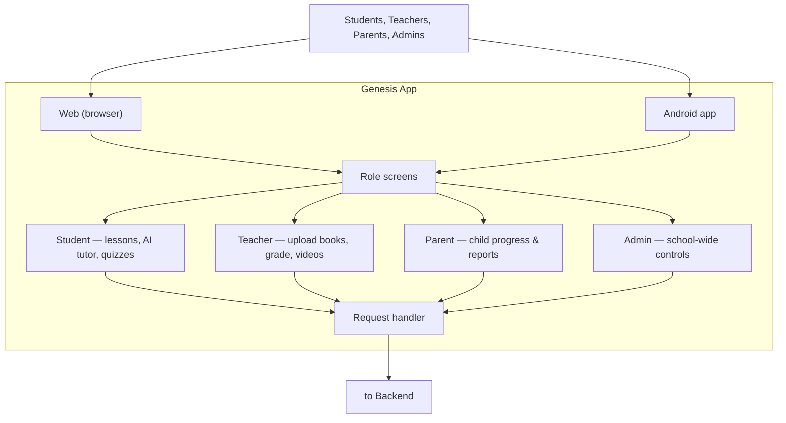
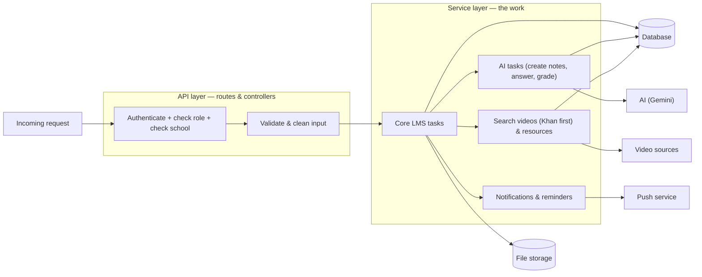
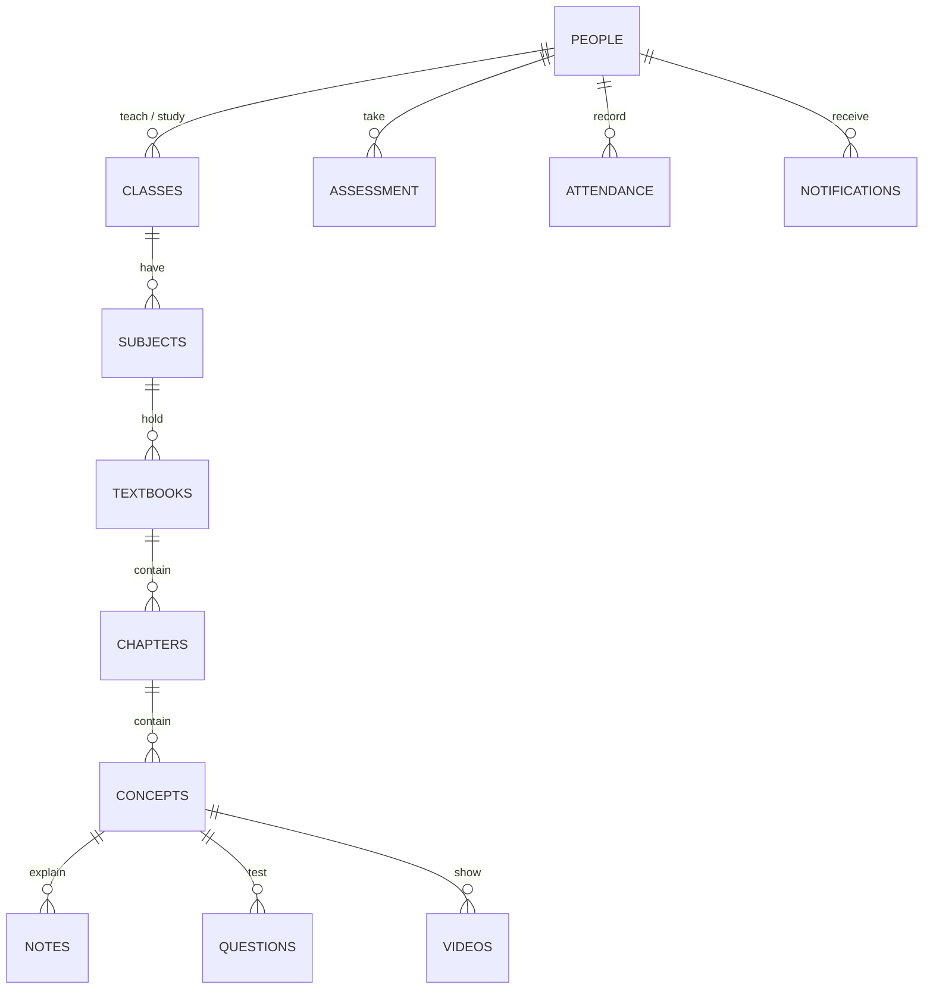
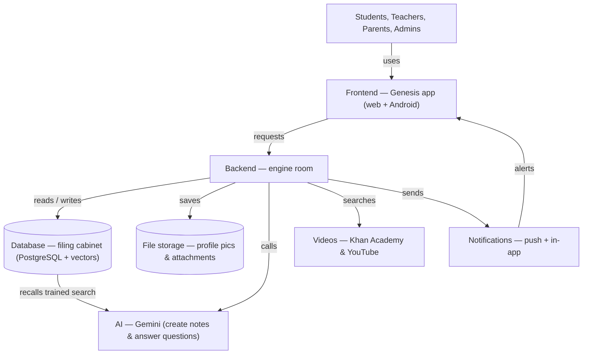

# Genesis LMS — Architecture Diagrams & Capacity

Four diagrams show the system from the outside in — what the users see, the engine behind it, where everything is remembered, and how it all connects — followed by the storage and token estimates for a full roll-out.

---

## 1. The Frontend — what users see

The frontend is the only part people interact with. It runs on the web browser and inside the Android app, so everyone uses the same system regardless of device.

**Notes:** one app for every role, one system for web and Android, and the app only passes requests to the backend — it does not store the real data itself.

---

## 2. The Backend — the engine room

The backend has no screen. It is the single place that checks who is asking, does the work, and touches real data. No request gets through unless the user is logged in, has the correct role, and belongs to the correct school.

**Notes:** identity and permission are checked before anything runs; all heavy work (reading books, grading, searching, notifying) happens here; the backend is the only part allowed to manage the data.

---

## 3. The Database — the filing cabinet

The database remembers everything permanently and keeps related items linked, so the system can always find "every lesson in this student's science book."

**Notes:** people (students/teachers/parents), classes & subjects, book content built from chapters down to concepts, assessment & marks, and the school record (attendance, fees, staff) all live together and are linked. The "search fingerprints" (vectors) used by the AI also live here.

---

## 4. How It All Connects

This is the whole system from start to finish — how a user's action travels through the app, into the engine, into the filing cabinet, and out to the outside helpers.

**Notes:** the app is the front desk, the backend is the only place that works with real data, the database is the permanent record, and the outside helpers (AI, videos, notifications) are called by the backend only when needed.

---

## 5. Capacity for 10 Classes × 10 Textbooks × ~200 Pages

Scope: **10 classes**, **10 textbooks per class** = **100 textbooks**, about **200 pages each** = **20,000 pages** in total. Figures are planning estimates so the setup can be sized correctly.

Costs are in Indian Rupees (₹). Conversion used: **$1 = ₹95** (market rate, August 2026). AI rates used (Gemini 3.1 Flash-Lite, August 2026): **input ₹23.75 per million tokens** ($0.25/M), **output ₹142.50 per million tokens** ($1.50/M).

### 5.1 One-time cost to read all 100 books

The AI reads each page once. "Tokens" are how the AI counts text. Reading the pages is an *input* use of the AI.

| Scenario | Tokens per page | All 100 books | ₹ cost (input) |
|---|---|---|---|
| Light | 500 | 10,000,000 | ≈ ₹238 |
| **Typical** | **750** | **15,000,000** | **≈ ₹356** |
| Heavy | 1,000 | 20,000,000 | ≈ ₹475 |

> Notes, questions and videos are written from these pages too (an *output* use). For ~100 books that adds roughly **₹1,400 – ₹3,000 one-time** on top of the reading cost, and is a fairer number when budgeting onboarding — see 5.2 for the method.

### 5.2 Ongoing cost every month

The monthly use is the recurring question-and-answer load, not the one-time reading of the books. Assumptions: **10 classes × 20 students = 200 students**; each asks the AI about **3 times a day**; **20 school days** per month → **12,000 questions** per month. Each question sends ~4,000 tokens in (the question + its background) and receives ~500 tokens out (the answer).

| Item | Tokens per month | Rate (₹/1M) | ₹ cost / month |
|---|---|---|---|
| Input tokens | 48,000,000 | ₹23.75 | ≈ ₹1,140 |
| Output tokens | 6,000,000 | ₹142.50 | ≈ ₹855 |
| **Total** | | | **≈ ₹1,995 / month** |

### 5.3 Overall storage for all 100 books

| Item | Size | Kept long-term? | ₹ cost |
|---|---|---|---|
| Textbook PDFs (100 × ~5–10 MB) | ~500 MB – 1 GB | **No** — deleted after reading | **₹0** (removed automatically) |
| Extracted page text | ~20–40 MB | Yes | bundled (see below) |
| Generated content (notes, questions, video list) | ~50–150 MB | Yes | bundled (see below) |
| Search vectors ("fingerprints") | ~90–100 MB | Yes | bundled (see below) |
| **Persistent total (database)** | **~150–300 MB** | Yes | **≈ ₹0 extra** (fits free tier) |
| Profile pictures | **none** (first-letter placeholder avatars, stored nowhere) | No | **₹0** |
| Assignment + book-cover attachments | small, grows slowly | Yes (Cloudinary) | separate Cloudinary billing, not Supabase |

**Supabase storage cost context (₹, August 2026):**
- **Free plan:** 500 MB database + 1 GB file storage at **₹0**. The ~150–300 MB of persistent data fits here, so there is **no storage bill** at this scale.
- **Pro plan:** ≈ **₹2,375 / month** (≈$25) includes 8 GB database + 100 GB file storage — this is a *flat* monthly fee, not a per-GB storage fee. Extra file storage beyond the included amount is ~**₹2 per GB per month**, and extra database space is ~**₹12 per GB per month**.

**Profile pictures removed → no storage used.** Profile photos are no longer uploaded or stored. Every user now shows a **first-letter placeholder avatar** (like Google / Gmail), which is generated from the name on the fly and stored nowhere. This removes the old `avatars` storage bucket usage entirely, so the only remaining file uploads are assignment and book-cover attachments (kept in Cloudinary, which is billed separately and does not touch the Supabase storage bill).

### 5.4 Is the storage enough? — Yes

Because textbook PDFs are removed after reading, scanned images are not saved, and profile pictures are not stored (first-letter placeholders instead), the long-term database is only **~150–300 MB** for all 100 books. That fits easily inside the Supabase free tier (500 MB database) and is a tiny fraction of the paid plan (8 GB), so storage costs **≈ ₹0 at this scale**. The only persistent file uploads left are assignment and book-cover attachments, which live in Cloudinary (separate from the Supabase storage quota). Spending on the ₹2,375/month Pro plan is about reliability (no auto-pausing, automatic backups, more bandwidth), not storage size. More storage can always be added later as more books and pictures arrive.

---

*All behaviour above was verified against the Genesis codebase. Costs use $1 = ₹95 (market rate, August 2026); AI rates are Gemini 3.1 Flash-Lite paid tier (August 2026); Supabase limits and pricing are as of July 2026. Token, storage and cost figures are planning estimates based on the stated assumptions.*
