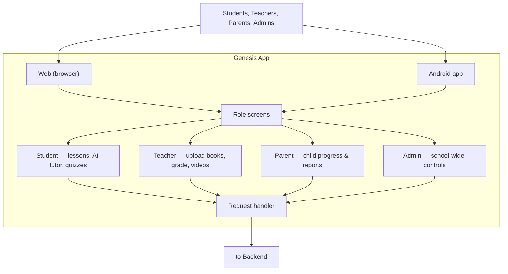
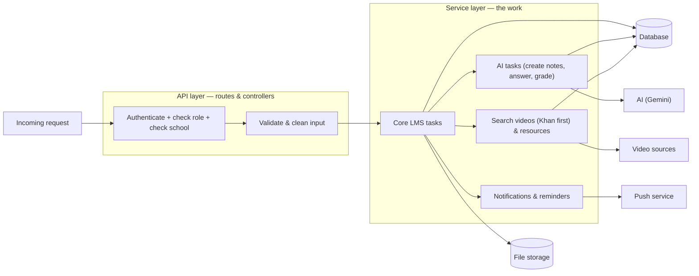
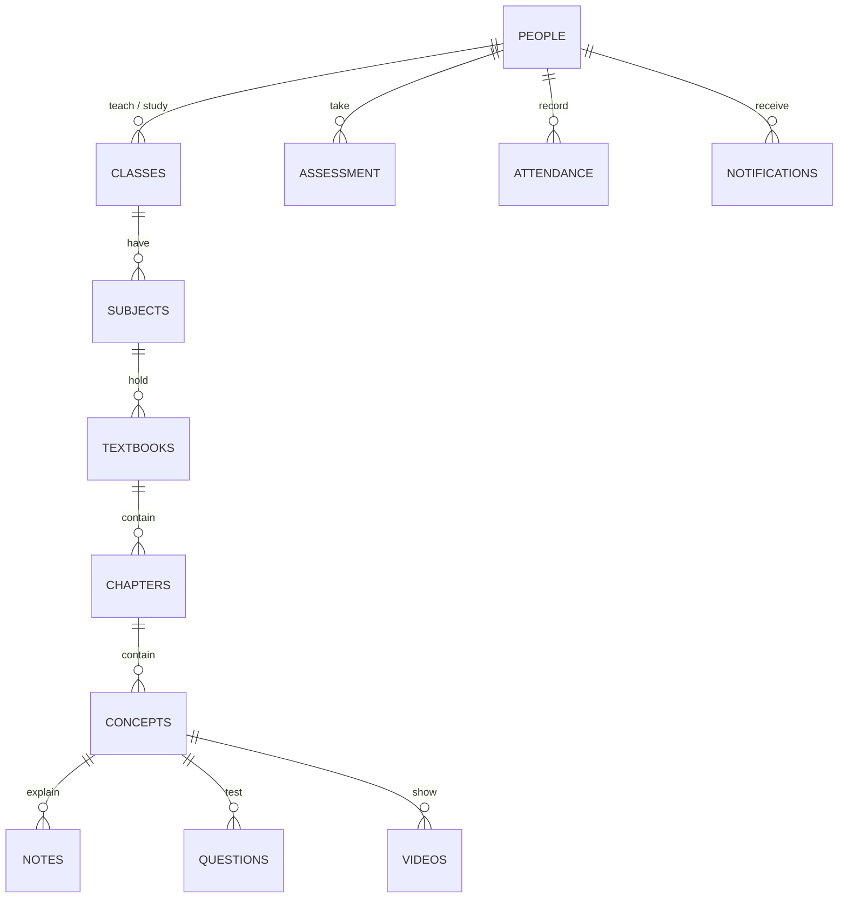
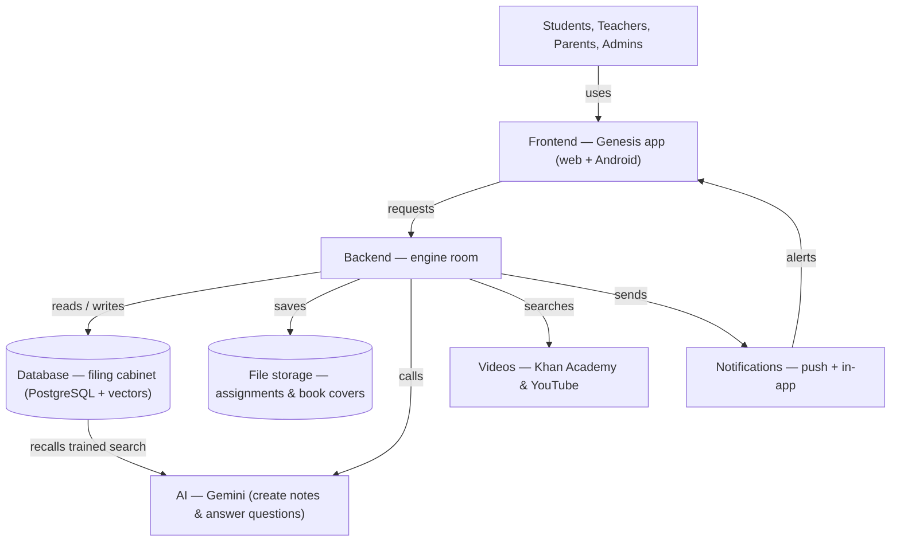

# Genesis LMS — Diagrams & Costing (Single Document)

This is the one reference document for how Genesis is put together and how much it costs to run a full roll-out. It has three parts:
1. **§1–§4 — Diagrams** — the system from the outside in (users → engine → database → everything connected).
2. **§5 — Token costing** — one-time reading of all books + the monthly question-and-answer load, in ₹.
3. **§6 — Storage costing** — how much space is used, that it fits the free tier, and exactly when it starts to cost money.

Scope used throughout: **10 classes**, **10 textbooks per class** = **100 textbooks**, about **200 pages each** = **20,000 pages** in total. All figures are planning estimates so the setup can be sized correctly.

> Exchange & rates used: **$1 = ₹95** (market rate, August 2026). **Gemini 3.1 Flash-Lite** (paid tier, August 2026): **input ₹23.75 per million tokens** ($0.25/M), **output ₹142.50 per million tokens** ($1.50/M). Supabase limits and pricing as of July 2026.

---

## 1. The Frontend — what users see

The frontend is the only part people interact with. It runs on the web browser and inside the Android app, so everyone uses the same system regardless of device.

**Notes:** one app for every role, one system for web and Android, and the app only passes requests to the backend — it does not store the real data itself.

---

## 2. The Backend — the engine room

The backend has no screen. It is the single place that checks who is asking, does the work, and touches real data. No request gets through unless the user is logged in, has the correct role, and belongs to the correct school.

**Notes:** identity and permission are checked before anything runs; all heavy work (reading books, grading, searching, notifying) happens here; the backend is the only part allowed to manage the data.

---

## 3. The Database — the filing cabinet

The database remembers everything permanently and keeps related items linked, so the system can always find "every lesson in this student's science book."

**Notes:** people (students/teachers/parents), classes & subjects, book content built from chapters down to concepts, assessment & marks, and the school record (attendance, fees, staff) all live together and are linked. The "search fingerprints" (vectors) used by the AI also live here.

---

## 4. How It All Connects

This is the whole system from start to finish — how a user's action travels through the app, into the engine, into the filing cabinet, and out to the outside helpers.

**Notes:** the app is the front desk, the backend is the only place that works with real data, the database is the permanent record, and the outside helpers (AI, videos, notifications) are called by the backend only when needed. Profile pictures are **not** stored — every user is shown a first-letter placeholder avatar instead.

---

## 5. Token Costing

"Tokens" are roughly how the AI counts text. The AI (Gemini 3.1 Flash-Lite) is paid per token in two ways:
- **Input** — text you send *to* the AI (reading book pages, sending a student's question). Cost: **₹23.75 / 1M tokens**.
- **Output** — text the AI writes *back* (notes, questions, answers). Cost: **₹142.50 / 1M tokens** (6× the input rate, because writing is more expensive than reading).

### 5.1 One-time cost — reading all 100 books

The AI reads each page once while a book is being set up. This is an *input* use.

| Scenario | Tokens per page | All 100 books (20,000 pages) | ₹ cost (input) |
|---|---|---|---|
| Light | 500 | 10,000,000 | ≈ ₹238 |
| **Typical** | **750** | **15,000,000** | **≈ ₹356** |
| Heavy | 1,000 | 20,000,000 | ≈ ₹475 |

> Notes, questions and videos are **written** from these pages too (an *output* use). For ~100 books that adds roughly **₹1,400 – ₹3,000 one-time** on top of the reading cost — a fairer figure when budgeting the initial set-up. (Method: it is the same 5.2 per-token approach applied to the text that is generated.)

### 5.2 Ongoing cost every month

The monthly use is the recurring question-and-answer load, not the one-time reading. Assumptions: **10 classes × 20 students = 200 students**; each asks the AI about **3 times a day**; **20 school days** per month → **12,000 questions** per month. Each question sends ~4,000 tokens in (question + background) and receives ~500 tokens out (answer).

| Item | Tokens per month | Rate (₹/1M) | ₹ cost / month |
|---|---|---|---|
| Input tokens | 48,000,000 | ₹23.75 | ≈ ₹1,140 |
| Output tokens | 6,000,000 | ₹142.50 | ≈ ₹855 |
| **Total** | | | **≈ ₹1,995 / month** |

> These figures scale directly with how many students use the AI and how often. They are a planning estimate, not an exact bill.

---

## 6. Storage Costing — is it enough, is it free, and when does it cost?

### 6.1 What takes up space (or doesn't)

| Item | Size | Kept long-term? | ₹ cost |
|---|---|---|---|
| Textbook PDFs (100 × ~5–10 MB) | ~500 MB – 1 GB | **No** — deleted after reading | **₹0** (removed automatically) |
| Extracted page text | ~20–40 MB | Yes | bundled (see below) |
| Generated content (notes, questions, video list) | ~50–150 MB | Yes | bundled (see below) |
| Search vectors ("fingerprints") | ~90–100 MB | Yes | bundled (see below) |
| **Persistent total (database)** | **~150–300 MB** | Yes | **≈ ₹0 extra** (fits free tier) |
| Profile pictures | **none** (first-letter placeholders, stored nowhere) | No | **₹0** |
| Assignment + book-cover attachments | small, grows slowly | Yes (Cloudinary) | separate Cloudinary billing, not Supabase |

### 6.2 The space is made small on purpose

- **Textbook PDFs are temporary.** Each PDF is stored only while it is being opened and read; once the text is pulled out (and notes/questions/videos are made) the PDF is **deleted automatically** (`textbook-cleanup.service.ts`, plus a background retry). The database row is cleared too. So 500 MB – 1 GB of PDFs never stays.
- **OCR images are not saved.** A scanned page is held in memory only while its text is read, then thrown away. Only the extracted text is kept.
- **Profile pictures are not stored at all.** Instead of uploading a photo, every user gets a **first-letter placeholder avatar** (Google / Gmail style) drawn from their name at run time. There is no `avatars` upload bucket to fill — so profile photos cost nothing and take up no space.
- What *is* kept long-term is small: the extracted text, the generated content, the search vectors (~150–300 MB in total), and file attachments (assignments, book covers) which live in **Cloudinary** (separate billing, not the Supabase quota).

### 6.3 Is it free now? — Yes

Supabase (July 2026):
- **Free plan:** 500 MB database + 1 GB file storage at **₹0**. The ~150–300 MB of persistent data fits here, so there is **no storage bill** at this scale.
- **Pro plan:** ≈ **₹2,375 / month** (~$25) includes 8 GB database + 100 GB file storage — a *flat* monthly fee, not a per-GB storage fee. Extra file storage beyond the included amount is ~**₹2 per GB per month**; extra database space is ~**₹12 per GB per month**.

At the full 100-book scope the persistent database stays **~150–300 MB**, comfortably inside the **free 500 MB** limit. **So storage costs ≈ ₹0.** You do not need to pay for more space just to handle this roll-out.

### 6.4 When does it start costing?

Storage only starts to cost money when the **persistent database grows past the free limit (500 MB)**. With ~150–300 MB for 100 books, that is not reached in normal daily use — it would only happen after **several more full book sets, new editions, and accumulated generated content.** Rough guide:

| Persistent DB size | Plan | Storage cost |
|---|---|---|
| up to ~500 MB (≈ this 100-book roll-out) | Free | **₹0** |
| ~500 MB – 8 GB | Pro (₹2,375/mo flat) | included — no extra |
| past 8 GB | Pro | ~**₹12 per GB per month** extra (database) |

(File attachments add a tiny amount via Cloudinary billing, separate from Supabase, and grow only as teachers/students upload assignments and covers.)

### 6.5 So why would you pay for Pro at all?

Not for size — it is for **reliability**. The **free** tier pauses the whole project after one week with no activity, has no automatic backups, and gives limited bandwidth (bad for a real, always-on school system). The **Pro** plan (~₹2,375/month) removes that idle-pause, adds automatic 7-day backups, more bandwidth, and ~16× the storage headroom (8 GB database / 100 GB files). For a live system, Pro is the sensible choice; for a test or low-usage rollout, the free tier is enough.

---

## 7. Bottom line for the 10×10×200 roll-out

| Item | Amount | ₹ cost |
|---|---|---|
| One-time: read all 100 books (typical) | 15 M input tokens | ≈ ₹356 |
| One-time: write notes/questions/videos from them | ~1,400 – 3,000 | ≈ ₹1,400 – ₹3,000 |
| Every month: student Q&A (200 students) | 48 M in + 6 M out | ≈ ₹1,995 / month |
| Storage (persistent, 100 books) | ~150–300 MB | **₹0** (fits free tier) |
| Profile pictures | none (placeholders) | **₹0** |

**In short:** the AI token cost is the main spend (~₹2,000/month ongoing for a school of 200 students, plus a few thousand one-time to set the books up). Storage is effectively **free** at this scale, and only starts costing if you grow far beyond 100 books or choose Pro for its reliability features rather than its size.

---

*All behaviour above was verified against the Genesis codebase. Costs use $1 = ₹95 (market rate, August 2026); AI rates are Gemini 3.1 Flash-Lite paid tier (August 2026); Supabase limits and pricing are as of July 2026. Token, storage and cost figures are planning estimates based on the stated assumptions.*
