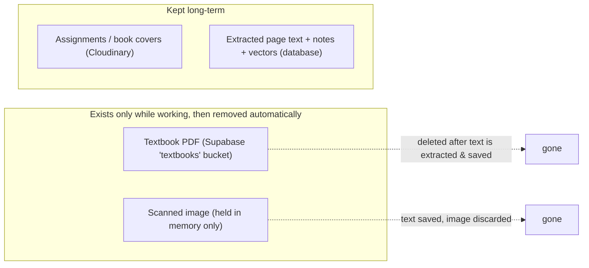
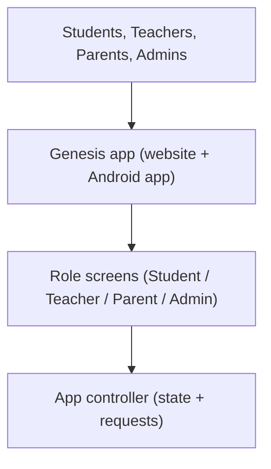
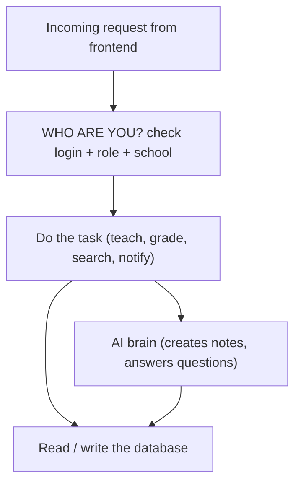
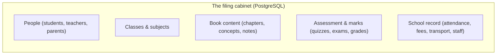
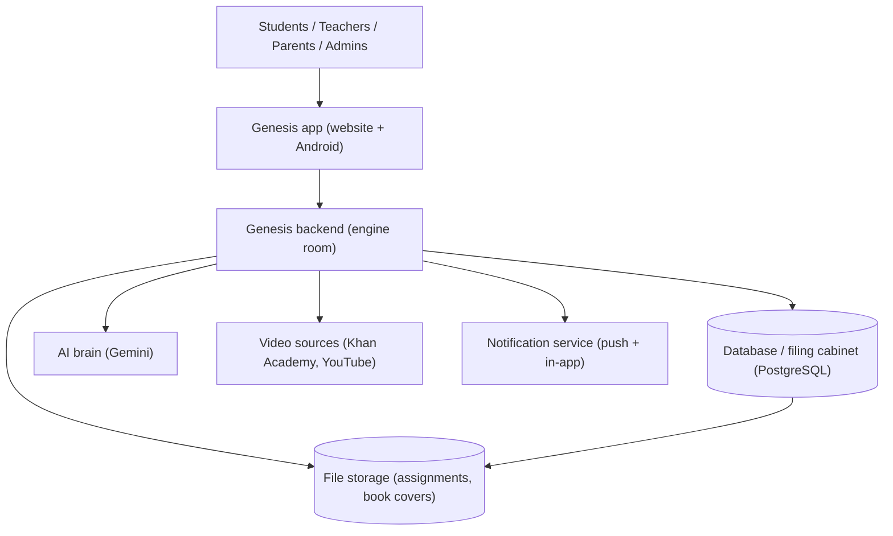

# Genesis LMS — Simple Architecture & Capacity

This document explains how Genesis is put together, step by step, and how much it costs to run for a typical roll-out (10 classes, 10 textbooks per class, roughly 200 pages each). Every diagram shows where data lives and how the pieces connect.

---

## 1. First, the question of where files are stored (and not stored)

A common worry is that uploading textbooks fills up storage. Genesis handles this **automatically**, and the design prevents storage waste:

- **Textbook PDFs are temporary.** A PDF is stored only while it is being opened and read. Once the text is pulled out (and notes, questions, and videos are created from it), the PDF is **deleted from storage by itself** — you do not have to clean it up. This is verified working in the code (`textbook-cleanup.service.ts`, connected to the processing pipeline, plus a background retry that catches any that failed). The PDF row in the database is also cleared.
- **OCR (reading text from a scanned image) does not keep the image.** When a student or teacher scans a page, the image is held briefly in memory, read by the text-recognition service, and then thrown away. Only the extracted text is saved.
- **Profile pictures are not stored at all.** Instead of uploading a photo, every user gets a **first-letter placeholder avatar** (like Google / Gmail) drawn from their name at run time. This means there is no `avatars` upload bucket to fill, so profile photos cost nothing and take up no space.
- **What is actually kept long-term:** file attachments (assignments, book covers) and the generated content that lives in the database. These are the small, permanent uploads.

> Bottom line: storage is not used for textbooks, and it is not used for profile pictures either (those are now first-letter placeholders stored nowhere). It is used only for the small permanent things (file attachments and the generated content that lives in the database).

---

## 2. The Frontend

The frontend is what people see — on a web browser and inside the Android app. It is one system that works everywhere.

- **One app, many roles.** Depending on who logs in, the same app shows the correct screens (a student sees lessons and the AI tutor; a teacher sees uploads and grading; an admin sees school-wide controls).
- **The app is the "front desk".** It collects what the user does and passes it to the backend. It never stores the real data itself — it just shows it and sends requests.

---

## 3. The Backend

The backend is the "engine room". It does not have a screen. It checks who you are, does the work, and talks to the database. It is the only part allowed to touch the real data.

- **It checks identity and permission first.** No request is processed before the backend confirms the user is logged in, has the right role, and belongs to the right school.
- **It does the heavy lifting.** Uploading and reading a textbook, creating lessons, marking work, searching for videos (Khan Academy first), and sending notifications all happen here.
- **No real work happens in the app.** The app only talks to the backend; the backend is the single place that manages data.

---

## 4. The Database

The database is the single, organized "filing cabinet" that remembers everything permanently.

- **Everything is stored together and linked.** A concept belongs to a chapter, which belongs to a textbook, which belongs to a class and subject. The links make it possible to show, for example, "all lessons for this student's science book".
- **Vectors live here too.** The database also holds the "search fingerprints" (called vectors) that let the AI find the right page when answering a question.

---

## 5. How It All Connects

Putting the three parts together with the outside services they rely on:

- **The app is the front desk** (shows screens, takes input).
- **The backend is the engine room** (the only place that works with real data).
- **The database is the filing cabinet** (remembers everything).
- **Outside helpers:** an AI service for creating/answering content, video sources for lesson clips, and notification services for alerts. The backend calls these as needed.

---

## 6. Capacity for 10 Classes × 10 Textbooks × ~200 Pages

Scope: **10 classes**, **10 textbooks per class** = **100 textbooks**, ~200 pages each = **20,000 pages** in total. Figures below are planning estimates so you can size the setup.

### 6.1 One-time tokens to read all 100 books

"Tokens" are roughly how the AI counts text. A page yields roughly this many:

| Scenario | Tokens per page | All 100 books |
|---|---|---|
| Light | 500 | 10,000,000 |
| **Typical** | **750** | **15,000,000** |
| Heavy | 1,000 | 20,000,000 |

### 6.2 Tokens per month (ongoing use)

The monthly AI use is the recurring question-and-answer load, not the one-time reading of books.

Assumptions: 10 classes × 20 students = **200 students**; each asks the AI about **3 times a day**; **20 school days** a month → **12,000 questions** per month. Each question uses ~4,000 tokens on the way in (question + background) and ~500 tokens on the way out (answer).

| Item | Per question | Per month |
|---|---|---|
| Input tokens | 4,000 | 48,000,000 |
| Output tokens | 500 | 6,000,000 |

> These figures depend on how many students and how often they use the AI. They are a planning estimate, not an exact bill.

### 6.3 Overall storage (100 books)

| Item | Size | Kept long-term? |
|---|---|---|
| Textbook PDFs (100 × ~5–10 MB) | ~500 MB – 1 GB | **No** — deleted after reading |
| Extracted page text | ~20–40 MB | Yes |
| Generated content (notes, questions, videos list) | ~50–150 MB | Yes |
| Search vectors | ~90–100 MB | Yes |
| **Total persistent (database)** | **~150–300 MB** | Yes |
| Profile pictures | **none** (first-letter placeholders, stored nowhere) | No |
| Assignments + book covers | small, grows slowly | Yes (Cloudinary, separate billing) |

### 6.4 Is Supabase enough? — Yes.

- Current Supabase limits (verified July 2026): Free = **500 MB database / 1 GB file storage**; Pro ≈ **$25 / month = 8 GB database / 100 GB file storage**, with automatic backups.
- Because textbook PDFs are **deleted after reading**, OCR images are **not saved**, and **profile pictures are not stored** (they are now first-letter placeholders), the long-term database is only **~150–300 MB** for all 100 books. That is **well inside even the free tier**, and a tiny fraction of the Pro plan.
- So **Supabase is more than sufficient for this scale** — no other database is needed. The only file uploads left (assignment and book-cover attachments) live in **Cloudinary**, which is billed separately and does not count against the Supabase quota.
- **When does storage start costing money?** At this scale it stays **≈ ₹0** on the free tier. It only begins to cost when the persistent database grows past **500 MB** (free limit) or **8 GB** (Pro). With ~150–300 MB for all 100 books, that is reached only after many more books, editions, and generated content accumulate — not in normal daily use. The real reason to pick the $25/month (~₹2,375) **Pro** plan is **reliability**, not size: the free tier pauses the project after a week without activity, has no automatic backups, and gives limited bandwidth. For a real, always-on system, Pro is the sensible choice, and it leaves huge headroom for growth.

---

*All "CURRENT / IMPLEMENTED" behaviour above was checked against the Genesis codebase. Pricing and limits for Supabase (July 2026) and Gemini 3.1 Flash-Lite (Aug 2026: $0.25/1M input, $1.50/1M output) are stated with their sources and dates. Token and storage figures are planning estimates based on the stated assumptions.*
