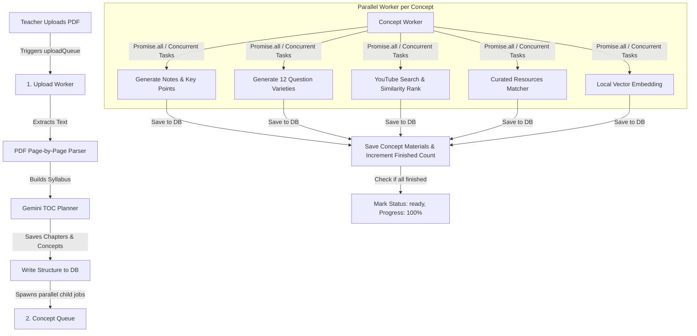

# Implementation Plan: High-Performance Textbook Processing Pipeline Redesign

We propose to replace the existing slow, fragmented 7-queue pipeline with an optimized, robust **two-queue background processing pipeline**. Since a high-performance Gemini API key is available with higher rate limits, we can eliminate slow throttles and combine related extraction tasks to maximize throughput and reliability.

---

## Proposed Pipeline Redesign

Instead of chain-linking 7 separate queues (which introduces overhead, points of failure, and slow delays), we will consolidate the pipeline into two highly cohesive queues:



---

## Architectural Improvements

### 1. Unified Concept Processing (Fault Isolation)
* **Old Way**: A single concept's enrichment was chained through 5 separate queues (`conceptQueue` → `questionQueue` → `videoQueue` → `resourceQueue` → `embeddingQueue`). If any link in the chain failed or lost connection, the pipeline halted, leaving the textbook permanently stuck in the `processing` state.
* **New Way**: A single concept job in `conceptQueue` handles all tasks for that concept from start to finish. If any sub-task fails, BullMQ automatically retries the entire concept job with exponential backoff.

### 2. High-Throughput Parallel Execution (`Promise.all`)
* **Old Way**: Aggressive serial delays (`delay(3000)`, `delay(4000)`) were injected into every step to prevent rate-limit errors on free keys.
* **New Way**: Using `Promise.all` inside the concept worker, we fetch notes, question banks, videos, resource matching, and embeddings concurrently. This reduces concept processing time from 3–5 minutes down to ~15 seconds per concept.

### 3. Consolidated LLM Prompts
* **Notes & Summary Prompt**: Generates the study summary, detailed notes, key points, LaTeX formulas, examples, and learning objectives in one structured JSON payload.
* **Question Bank Prompt**: Generates all required questions (multiple variety types) in a single consolidated LLM query, reducing API overhead.

### 4. Simplified Progress Tracking
* The `uploadWorker` counts total concepts.
* As each concept finishes in `conceptQueue`, the worker updates a simple finished concepts counter and calculates exact progress:
  $$\text{Progress} = 25 + \left(\frac{\text{Completed Concepts}}{\text{Total Concepts}}\right) \times 75\%$$
* The last concept to complete marks the textbook status to `ready`.

---

## Proposed Changes

### [Backend Component]

#### [MODIFY] [queue.ts](file:///c:/Users/USER/Desktop/school/lms/backend/src/jobs/queue.ts)
* Simplify to register only two queues: `uploadQueue` and `conceptQueue`.
* Remove the five legacy queues.

#### [MODIFY] [worker.ts](file:///c:/Users/USER/Desktop/school/lms/backend/src/jobs/worker.ts)
* **Upload Worker (`uploadQueue`)**:
  - Parse PDF pages to raw text.
  - Call Gemini to build chapters & concepts curriculum structure.
  - Save structure to Firestore.
  - Add parallel jobs to `conceptQueue` for each concept.
* **Concept Worker (`conceptQueue`)**:
  - Implement concurrent pipeline execution using `Promise.all` for:
    1. Study Notes, Summary, Key Points, LaTeX Formulas, Solved Examples.
    2. Question Bank Generation (12 types, structured JSON).
    3. YouTube Video Search, Embedding Comparison, and Ranking.
    4. Curated Static Reference matching and ranking.
    5. Concept local vector embedding.
  - Write all results to Firestore.
  - Check completion state of other concepts and finalize textbook status to `ready`.

---

## Verification Plan

### Automated Tests
* Run the unit tests to verify existing search rankers and local transformers work as expected:
  ```bash
  npm test
  ```

### Manual Verification
* **Upload Test**: Upload a textbook PDF and check that it successfully triggers `uploadQueue`.
* **Real-time Monitoring**: Open the textbook detail page in the teacher portal, and monitor the live progress timeline updating from 25% to 100% in real-time.
* **Verify Outputs**: Verify that Study Notes, Videos, Question Bank, and Resources are populated and accessible to students.
