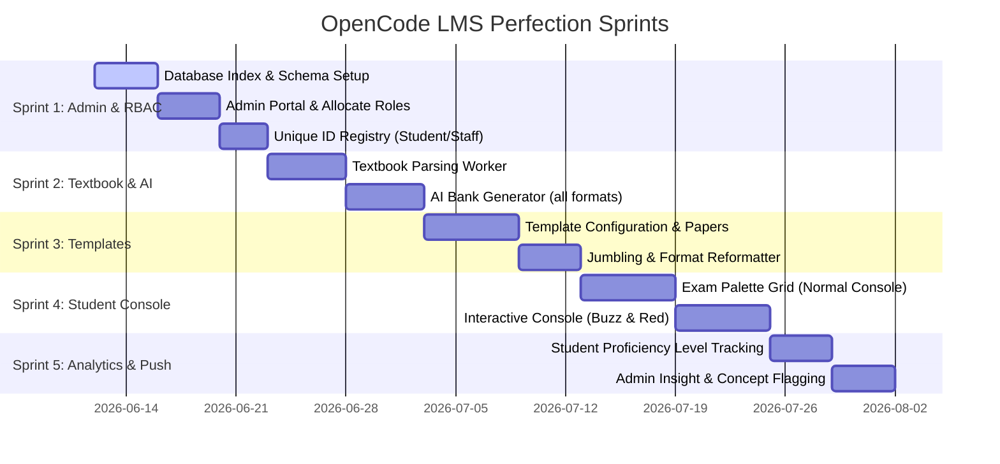

# OpenCode LMS: Complete Implementation & Perfection Plan

This master plan details the architecture, data models, workflows, and step-by-step roadmap to implement the OpenCode Learning Management System (LMS) with perfection. It integrates an **Admin (Principal) Oversight Portal**, **Teacher Classroom Management**, **eTutor-style Modular Test Template Engine**, **AI Textbook Parsing**, and **Adaptive Student Test Systems (Normal & Interactive)**.

---

## 1. System Architecture & Database Design

To support the required modularity, the data schema leverages an **eTutor-inspired separation of Templates, Question Papers, and Test Instances**.

### 1.1 Core Collections Schema

```
classes/
  {classId}/
    name: string                # e.g., "Grade 10 - Section A"
    grade: string               # e.g., "10"
    section: string             # e.g., "A"
    academicYear: string        # e.g., "2026-2027"
    isActive: boolean
    createdAt: timestamp

subjects/
  {subjectId}/
    name: string                # e.g., "Mathematics"
    code: string                # e.g., "MATH101"
    classId: string             # FK to classes
    createdAt: timestamp

users/
  {uid}/
    email: string
    displayName: string
    role: "admin" | "teacher" | "student"
    isActive: boolean
    # Teacher Specific
    classIds: string[]          # Classes this teacher is assigned to
    # Student Specific
    classId: string             # FK to classes (student belongs to exactly one class)
    studentId: string           # Unique Student ID (RollNo + Class + AcademicYear)
    rollNo: number
    academicYear: string
    level: string               # Current student global level (beginner | intermediate | advanced)
    createdAt: timestamp

teacher-class-subject/          # Junction collection enforcing "One Teacher per Subject per Class"
  {junctionId}/                 # ID format: classId_subjectId
    teacherId: string           # FK to users
    classId: string             # FK to classes
    subjectId: string           # FK to subjects
    assignedAt: timestamp
```
> [!IMPORTANT]
> **Unique Teacher Assignment Constraint**: The document ID in `teacher-class-subject` is structured as `classId_subjectId`. Before assigning a teacher, the system checks if a document with this ID already exists. If it exists, the assignment is blocked, enforcing the rule that a subject in a class can be taught by at most one teacher.

---

### 1.2 Textbook & AI-Generated Content

When a teacher uploads a textbook, the system generates chapters, concepts, video links, and a question bank *at once*.

```
textbooks/
  {textbookId}/
    title: string
    classId: string
    subjectId: string
    teacherId: string
    status: "processing" | "ready" | "failed"
    createdAt: timestamp

textbooks/{textbookId}/chapters/
  {chapterId}/
    title: string
    order: number
    summary: string

textbooks/{textbookId}/chapters/{chapterId}/concepts/
  {conceptId}/
    title: string
    order: number
    notes: string
    videoLinks: string[]        # AI-curated video link suggestions
    questionBank: Question[]    # Embedded question bank array
```

#### Concept Question Schema
```typescript
interface Question {
  id: string;
  conceptId: string;
  type: "mcq" | "true_false" | "fill_blank" | "matching" | "descriptive" | "numerical" | "passage";
  difficulty: "easy" | "medium" | "hard" | "hots";
  text: string;
  options?: string[];           // For MCQ, matching
  correctAnswer: string;        // Stringified correct answer(s)
  passageText?: string;         // For passage type
  explanation?: string;
  points: number;
}
```

---

### 1.3 eTutor-style Assessment & Template Collections

We separate the **design** of the assessment (Template) from the **generated questions** (Question Paper) and the **scheduled assignment** (Test).

```
test_templates/                 # Template containing layout & config rules
  {templateId}/
    title: string
    teacherId: string
    timeLimitMinutes: number
    questionCount: number
    jumbleQuestions: boolean
    difficultyDistribution: {
      easy: number;             # % of easy questions
      medium: number;           # % of medium questions
      hard: number;             # % of hard questions
      hots: number;             # % of HOTS questions
    }
    allowedFormats: string[]    # ["mcq", "fill_blank", "matching", "descriptive", "numerical", "passage"]
    createdAt: timestamp

question_papers/                # Generated set of questions mapping to a textbook chapter/concept
  {paperId}/
    templateId: string          # FK to test_templates
    conceptId?: string
    chapterId?: string
    questions: Question[]       # Deep copy of modified questions generated from bank
    totalPoints: number

tests/                          # Pushed test instance assigned to students
  {testId}/
    title: string
    paperId: string             # FK to question_papers
    classId: string             # Target class
    subjectId: string
    teacherId: string
    type: "quiz" | "assignment" | "exam"
    isRepublished: boolean      # If true, triggers interactive test mode
    showResults: boolean        # Results visibility to students
    releasedAt: timestamp
    dueDate: timestamp?
    attemptCount: number
```

---

## 2. Core Workflows & User Dashboards

### 2.1 Admin (Principal) Workflow & Portal
*   **Class & Subject Creation**: Creates classes (Grade, Section, Academic Year) and configures subjects under each class.
*   **Teacher Allocation**: Assigns teachers to subjects in specific classes. The system queries the `teacher-class-subject` collection to ensure no subject in a class has more than one teacher.
*   **Credentials Generation**: Generates unique username/password for teachers and registers them.
*   **Student Registry**: Creates students by entering their name, class, academic year, and roll number.
    *   *ID Generation*: Auto-generates a unique student ID: `[AcademicYear]_[ClassCode]_[RollNo]` (e.g., `2026_10A_05`).
*   **Oversight Analytics**: Dashboard showing class-wise and subject-wise averages. Admin can view students' grades, attempt status, and concept mastery. Admin can flag low-mastery concepts (e.g., $<50\%$) and issue a system notification prompting the teacher to re-teach the concept.

### 2.2 Teacher Workflow & Portal
*   **Class Isolation**: Upon login, the teacher only sees data and actions corresponding to their assigned `teacher-class-subject` allocations.
*   **Textbook Upload & AI Processing**: Uploads textbook PDFs. An asynchronous background worker triggers the LLM pipeline to:
    1.  Parse chapters and concepts.
    2.  Extract study notes and generate video reference links.
    3.  Generate a massive, diverse question bank covering all formats (MCQ, matching, blanks, numerical, descriptive, passage-based) and difficulty levels (easy to HOTS).
*   **Pushing Assessments**:
    1.  Teacher enters their classroom page, selects a concept/chapter, and clicks "Create Test".
    2.  Selects an existing Template or configures a new one (questions count, timer, formats, difficulty distribution, shuffle toggle).
    3.  The backend reads the concept's question bank, selects questions matching the criteria, reformats/adapts them as specified in the template, and generates a `question_paper`.
    4.  Teacher pushes the test as a `quiz`, `assignment`, or `exam` to the class, setting it to draft or released.
*   **Republishing Tests (Interactive Mode)**:
    1.  Teacher can click "Republish" on an already completed test.
    2.  A new test instance is pushed with `isRepublished: true`.
    3.  Students taking this version experience real-time correction feedback.

### 2.3 Student Workflow & Portal
*   **Upcoming Task Notifications**: The student dashboard displays all released tests (quizzes, assignments, exams) assigned to their `classId`.
*   **The Exam Console (Normal Test)**:
    -   Standard full-screen examination layout.
    -   A floating question palette showing boxes for:
        -   ⚪ **Unvisited**: Question not viewed.
        -   🟡 **Visited**: Viewed but unanswered.
        -   🟢 **Attempted**: Answered.
        -   🔵 **Marked for Review**: Flaged for secondary check (with or without answer).
    -   Submission is enforced by a countdown timer. Auto-submits when time expires.
*   **Interactive Exam Console (Republished Test)**:
    -   Interactive, immediate-feedback layout.
    -   When a student selects an answer:
        -   *Wrong Answer*: Sound buzzer triggers, option highlights in red with a cross, and the interface prompts: *"Incorrect. Try again!"* The question remains active.
        -   *Correct Answer*: Highlights in green, triggers a success tone, and automatically transitions to the next question.
    -   This mode acts as active retrieval practice and does not affect the student's primary exam grade.

---

## 3. Advanced Engine Mechanics

### 3.1 AI Adaptation & Reformatting Engine
When a test is generated, the backend fetches questions from the concept bank and adapts them:
-   **True/False to MCQ**: An assertion is reformatted as: *"Is the following statement True or False: [Assertion]?"* with options `["True", "False"]`.
-   **MCQ to Fill in the Blank**: The question text remains, but options are stripped, and a regex validator is generated based on the correct answer.
-   **Difficulty Filtering**: Filters questions based on the target student's adaptive level.

### 3.2 Student AI Level Calculation
After each assessment submission, the student's proficiency level for that concept is updated:

$$\text{Accuracy} = \frac{\text{Correct Points}}{\text{Total Points}}$$

$$\text{Reaction Time Factor} = \frac{\text{Average Time Taken Per Question}}{\text{Standard Concept Time}}$$

$$\text{Complexity Handled} = \max(\text{Difficulty Rank of Correctly Answered Questions})$$

*Difficulty Ranks: easy = 0, medium = 1, hard = 2, hots = 3.*

**Level Mapping**:
*   $\text{Accuracy} \ge 85\%$ AND $\text{Complexity Handled} \ge 2 \implies \text{Advanced}$
*   $\text{Accuracy} \ge 70\%$ AND $\text{Complexity Handled} \ge 1 \implies \text{Intermediate}$
*   $\text{Accuracy} < 70\% \implies \text{Beginner}$

---

## 4. Step-by-Step Implementation Roadmap



### Sprint 1: Multi-tenant RBAC & Allocation Safeguards
1.  **Database Configuration**: Set up Firestore/MySQL tables matching Section 1.1. Add composite indexes on `teacher-class-subject` for query optimization.
2.  **Unique Credentials Generation**: Implement backend utility to hash and store teacher and student passwords. Write the student ID generator `[Year]_[Class]_[Roll]` ensuring absolute uniqueness.
3.  **Admin Portal UI**: Develop pages to manage classes, add subjects, and assign teachers with the "One Teacher per Subject per Class" validation rule enforced server-side.

### Sprint 2: AI Textbook Extraction & Question Bank Generator
1.  **PDF Parsing Pipeline**: Implement textbook upload route. Trigger an asynchronous worker (using queues/Celery/Vercel functions) to parse PDF chapters.
2.  **LLM Question Generation API**: Integrate Gemini/OpenAI API to generate content notes, search queries for YouTube video references, and create 50+ questions per concept across MCQ, numerical, fill blanks, descriptive, passage, and matching formats.

### Sprint 3: eTutor Template & Question Paper Generator
1.  **Template Builder Component**: Build UI where teachers configure templates (formats, time limits, difficulty percentages, jumble toggle).
2.  **Question Reformatting Service**: Code the backend class that reads templates, selects appropriate questions, shuffles them if enabled, reformats types dynamically (e.g., stripping MCQ options to create fill-blanks), and compiles the final `question_paper` document.

### Sprint 4: Student Exam Console & Interactive Mode
1.  **Normal Exam Console**: Build the full-screen student view. Create the sidebar question palette displaying visited (yellow), unvisited (gray), attempted (green), and marked for review (blue) statuses.
2.  **Interactive Test Player**: Build the republished test UI. Implement sound synthesis (using Web Audio API or audio assets) for correct chime and wrong buzz. Add animations for red crosses and green checkmarks. Add transition logic to skip to the next question automatically upon correct answer selection.

### Sprint 5: Student AI Profiles & Oversight Analytics
1.  **AI Profiling Engine**: Code the post-test trigger that calculates accuracy, time spent, and complexity handled to update the student's level on a per-concept basis.
2.  **Admin Re-teach Portal**: Add a "Concept Health Matrix" to the Admin Dashboard. Highlight concepts where student average score drops below 50%. Provide a "Notify Teacher to Re-teach" action triggering automated teacher notification alerts.
